# Projektdokumentation – Digitales Ideenboard (IdeaboardWebsite)

> Sprache: Deutsch | Stand: 2026-03-11


---


> **Code-Dokumentation (JSDoc):** Eine detaillierte Dokumentation der Klassen, Methoden und API-Strukturen wurde bereits mittels JSDoc generiert und befindet sich im Ordner `dokumentation/`. Sie kann jederzeit durch den Befehl `npm run doc:gen` (bzw. `bun doc:gen`) aktualisiert werden, um die neuesten Code-Kommentare einzubinden.

---

## 1. Installations- & Start-Anleitung (Quickstart)

In diesem Kapitel erfahren Sie, wie Sie das Projekt auf Ihrem System einrichten. Wir unterscheiden zwischen zwei Haupt-Szenarien.

### 1.1 Voraussetzungen (Prerequisites)

Bevor Sie beginnen, müssen folgende Komponenten installiert sein:
*   **Runtime:** [Node.js](https://nodejs.org/) (v20+) oder [Bun](https://bun.sh/) (gleichwertig unterstützt).
*   **Datenbank:** [MariaDB](https://mariadb.org/) (v12.1) oder MySQL.
    *   **Konfiguration:** Nutzen Sie die optimierten Einstellungen aus [config/mariaConf_my.ini(win)_oder_my.cnf(unix)/](config/mariaConf_my.ini(win)_oder_my.cnf(unix)/).
    *   **Tuning-Hinweis:** Passen Sie die Arbeitsspeicher-Buffer in der `my.ini` / `my.cnf` unbedingt an Ihren Host an.
        *   `innodb_buffer_pool_size`: Setzen Sie dies auf ca. 50-75% Ihres RAMs (z.B. `12G` bei 16GB RAM), um die Datenbank-Performance zu maximieren.
        *   `aria_pagecache_buffer_size`: Aria wird nur noch für interne temporäre Tabellen und die monatlichen Statistiken genutzt. Ein Wert von `512M` bis `1G` ist hier völlig ausreichend.
*   **Redis (Empfohlen):** Für Live-Updates und Performance. Am einfachsten via Docker:
    ```bash
    docker compose up -d redis
    ```
*   **Reverse Proxy (Optional):** [Caddy](https://caddyserver.com/download) für lokale HTTPS-Entwicklung und Multi-Core Betrieb.

---

### 1.2 Szenario A: Einfacher Single-Process (Entwicklung)

Ideal für die schnelle lokale Entwicklung. Da nun alle Vorbereitungen (Geheimschlüssel-Generierung und Datenbank-Migrationen) in die Start-Befehle integriert sind, ist der Start extrem einfach.

1.  **Abhängigkeiten installieren:**
    ```bash
    npm install  # oder: bun install
    ```
2.  **Konfiguration (.env):** Erstellen Sie eine `.env` Datei (Basis: `.env.example`).
    ```dotenv
    PORT=3000
    TRUST_PROXIES=0  # WICHTIG: 0 bei direktem Zugriff ohne Proxy
    # SESSION_SECRET wird automatisch generiert, falls nicht gesetzt
    DB_HOST=localhost
    REDIS_URL=redis://127.0.0.1:6379
    ```
3.  **Starten:**
    Wählen Sie Ihren bevorzugten Befehl (alle integrieren Migrationen & Secret-Gen):
    ```bash
    npm run devStart   # Node.js + Nodemon (Watch-Mode)
    npm run bunStart   # Bun (Watch-Mode)
    npm start         # Standard Node.js Start (Produktion/Einfach)
    ```
  *   **Ergebnis:** Die Website ist unter `http://localhost:3000` erreichbar.
  *   **Einordnung:** Dieser Single-Process-Betrieb funktioniert bewusst auch komplett ohne Caddy und ist der einfachste Weg für lokale Entwicklung, schnelle Tests und funktionale Checks.

4.  **Datenbank-Import (Optional):**
    Wenn Sie direkt mit einem fertigen Datensatz (inkl. Testdaten) starten möchten, können Sie die bereitgestellte [backup.sql](backup.sql) importieren:
    ```bash
    mysql -u [user] -p ideaboard < backup.sql
    ```
    *Hinweis:* Der normale Start (`npm run devStart`) führt automatisch alle nötigen Migrationen für eine leere Datenbank aus.

---

### 1.3 Szenario B: Multi-Process mit Caddy & HTTPS (Produktion/Professional)

Dieses Setup nutzt Caddy für TLS-Terminierung (HTTPS), HTTP/3 und erlaubt den Betrieb mehrerer Kerne via PM2. Wichtig: Multi-Process funktioniert in dieser Anwendung nicht korrekt ohne Caddy oder einen anderen Reverse Proxy, weil die Session-/Cookie-Konfiguration in diesem Modus ausdrücklich auf Proxy- und HTTPS-Betrieb ausgelegt ist.

1.  **PM2 Installation:**
    ```bash
    npm install -g pm2
    ```
2.  **Konfiguration (.env):**
    ```dotenv
    PORT=3000        # Interner Port der Node-Instanzen
    TRUST_PROXIES=1  # WICHTIG: 1 aktiviert Proxy-Vertrauen (X-Forwarded-For)
    SESSION_SECRET=Ihre_Sichere_Zeichenfolge
    # Redis ist hier ZWINGEND für die Kommunikation zwischen den Prozessen (SSE Sync)
    REDIS_URL=redis://127.0.0.1:6379 
    ```
3.  **Caddy starten (Lokale HTTPS-Zertifikate):**
    Nutzen Sie die [Caddyfile.local](Caddyfile.local) für automatisches HTTPS auf localhost (`tls internal`).
    ```bash
    caddy run --config Caddyfile.local
    ```
    *Hinweis:* Bestätigen Sie die Installation des lokalen CA-Zertifikats, wenn Ihr OS danach fragt. Rufen Sie die Anwendung im Caddy-Betrieb im Browser einfach als `localhost` auf; Caddy stellt lokal automatisch HTTPS bereit.
4.  **Cluster-Start via PM2:**
    Wählen Sie je nach gewünschter Runtime:
    *   **Node.js Cluster-Mode (empfohlen):** Verteilt die Last auf alle CPU-Kerne.
        ```bash
    pm2 start ecosystem.config.js --env production --only "ideenboard-node-cluster"
        ```
    *   **Bun Fork-Mode:** Nutzt die Bun-Laufzeit für maximale Performance.
        ```bash
    pm2 start ecosystem.config.js --env production --only "ideenboard-bun-fork"
        ```
    *   **Vorteil:** TLS-Terminierung durch Caddy sorgt für sichere Cookies (`Secure`, `SameSite=None`), während Redis die Live-Updates zwischen allen Instanzen synchronisiert.
    *   **Wichtig:** Ein lokaler Multi-Process-Start ohne Caddy oder einen anderen Reverse Proxy ist hier kein unterstützter Betriebsweg und funktioniert nicht zuverlässig, weil Cookies, Proxy-Header und Session-Verhalten dann nicht zum erwarteten Betriebsmodell passen.

---

## 2. Benutzerhandbuch (Detaillierte Bedienungsanleitung)

Hier erhalten Sie eine umfassende Übersicht über die Funktionen und die Bedienung der einzelnen Module des Ideenboards.

> **Tipp für Tester:** Um die **Live-Synchronisation** (SSE) und die **Echtzeit-Chats** optimal zu erleben, öffnen Sie die Anwendung gleichzeitig mit **zwei verschiedenen Benutzern** in unterschiedlichen Browsern (z. B. Chrome und Firefox) oder einem Inkognito-Fenster. Sie können so in Echtzeit sehen, wie Nachrichten, Likes und Emoji-Reaktionen sofort auf der anderen Seite erscheinen.
>
> *Hinweis zum Verhalten:* Während die Ideen-Liste (`/ideas`) und die Chats (`/dms`, `/groups`) hocheffizientes SSE-Streaming für echte Live-Updates nutzen, verwenden andere Bereiche (wie das Dashboard oder die Projektliste) bewusst klassisches HTMX-Polling oder laden nur bei Interaktion nach. Dies ist architektonisch so gewollt, da Echtzeit-Funktionen dort eine geringere Priorität haben und dieser Ansatz die Entwicklung deutlich vereinfacht und den Code schlank hält.

### 2.1 Authentifizierung & Kontoverwaltung
*   **Anmeldung & Registrierung:**
    *   Nutzen Sie das Formular auf der Startseite. Über den „Registrieren“-Tab erstellen Sie ein neues Konto.
    *   Passwörter werden mittels **Argon2id** sicher verschlüsselt. Nach der Registrierung erhalten Sie automatisch die Rolle „Mitarbeiter“.
*   **Mein Konto (Profil):**
    *   **Benutzername:** Ändern Sie Ihren Anzeigenamen jederzeit (wirkt sich sofort auf alle Ihre Ideen/Kommentare aus).
    *   **Gamification:** Verfolgen Sie Ihre Engagement-Punkte. Punkte werden für das Erstellen von Ideen, Erhalten von Likes und aktive Teilnahme vergeben.
    *   **Passwort:** Aktualisieren Sie Ihr Passwort regelmäßig unter Angabe des alten Passworts zur Verifizierung.

### 2.2 Das interaktive Ideen-Board (`/ideas`)
Das Herzstück der Anwendung zur Erfassung und Förderung von Innovationen.
*   **Ideen einreichen:**
    *   Verwenden Sie den schwebenden „+“-Button. Jede Idee benötigt einen Titel, eine detaillierte Beschreibung und eine Kategorie.
    *   **Verschlagwortung:** Fügen Sie Tags hinzu, um die Auffindbarkeit zu erhöhen.
    *   **Dateianhänge:** Laden Sie Bilder oder Dokumente (bis 25 MB) hoch. Diese werden serverseitig sicher verarbeitet.
*   **Bewertungssystem (Likes/Dislikes):**
    *   Sie verfügen über **3 Likes pro Woche**. Ein Like kann gegen ein Dislike getauscht (XOR) oder zurückgenommen werden.
    *   Die „Top 3 Ideen der Woche“ werden basierend auf der Netto-Bewertung im Dashboard hervorgehoben.
*   **Kommunikation:**
    *   **Kommentare:** Schreiben Sie Feedback (max. 200 Zeichen). Kommentare können selbst geliked werden.
    *   **Emoji-Reaktionen:** Halten Sie die Maus über einen Kommentar (oder tippen Sie darauf), um das Emoji-Menü zu öffnen. Die Reaktionen werden in Echtzeit für alle Nutzer aktualisiert.
*   **Suche & Navigation:**
    *   Die **Ideen-Suche** nutzt eine hocheffiziente SQL-Fulltext-Engine (MariaDB `ideas_search` Aria-Tabelle) für maximale Performance bei großen Datenmengen.
    *   Für überschaubare Datenmengen (z. B. Projekte, Nutzer-Suche) wird **Fuse.js** für Tippfehler-Toleranz (Fuzzy) eingesetzt, da dies hier die Entwicklung vereinfacht und schlank hält.
    *   Nutzen Sie den **Deep-Link-Support**: Jede Karten-ID kann direkt über die URL angesteuert werden (z. B. `/ideas#idea-123`).
    *   **Idee → Projekt (Konvertierung):** Vielversprechende Ideen können durch Admins und Projektleiter direkt in ein Projekt umgewandelt werden. Das Projektformular wird mit Titel und Beschreibung der Idee vorausgefüllt und die Idee erhält nach erfolgreicher Konvertierung automatisch den Status **„Umgesetzt“**.

### 2.3 Projektverwaltung & Team-Kollaboration (`/projects`)
*   **Projekt-Monitoring:**
    *   Verfolgen Sie Projekte durch die Phasen **Konzeption**, **Umsetzung** und **Abgeschlossen**.
    *   Der Fortschrittsbalken visualisiert den realen Fertigstellungsgrad.
*   **Team-Management:**
    *   Als Admin oder Projektleiter können Sie Mitglieder hinzufügen oder entfernen.
  *   **Rollen beim Erstellen:** Admins können beim Erstellen eines Projekts beliebige Ansprechpartner (Contact Person) zuweisen. Projektleiter, die ein Projekt anlegen, werden automatisch als Ansprechpartner gesetzt.
  *   **Gruppenchat-Integration:** Für jedes Projekt wird ein Gruppenchat angelegt; die Projekt-Ansprechpartner werden automatisch zum Besitzer (Owner) des zugehörigen Gruppenchats.
    *   Klicken Sie auf ein Team-Mitglied, um sofort einen **privaten Chat (DM)** zu starten.

### 2.4 Messaging-Zentrale (`/dms`, `/groups`)
*   **Direktnachrichten (DMs):** Private 1:1 Kommunikation mit sehr schneller Zustellung via SSE.
*   **Gruppenchats:** Automatisch erstellte Räume pro Projekt oder manuell angelegte Gruppen.
*   **HTMX-Streaming-Technologie:** Nachrichten werden mittels Server-Sent Events (SSE) in Echtzeit gestreamt und via HTMX nahtlos in die Oberfläche eingefügt.
*   **Präsenz-Anzeige:** Sehen Sie via Online-Punkt, welche Kollegen aktuell erreichbar sind.

*   **Admin View-Only (Sicht ohne Mitgliedschaft):** Admins können Gruppen auch dann einsehen, wenn sie nicht Mitglied sind; in diesem Fall erhalten sie eine reine Leseansicht (keine Schreibrechte). Admin-Viewers werden zudem nicht in die Online-/Präsenz-Liste gezählt, um Präsenzstatistiken korrekt zu halten.

### 2.5 Analyse-Dashboard (`/dashboard`)
*   **Live-Statistiken:** Ein dynamisches Dashboard, das Widgets (Metriken, Top-Nutzer, Trends) mittels HTMX asynchron nachlädt.
*   **Zeitliche Auswertung:** Balkendiagramme zeigen die Ideen-Entwicklung der letzten 6 Monate.
*   **Top-Kategorien:** Eine prozentuale Verteilung zeigt, in welchen Bereichen die meisten Innovationen entstehen.

### 2.6 Umfragen & Meinungsbild (`/surveys`)
*   **Teilnahme:** Stimmen Sie an öffentlichen oder privaten Umfragen ab; die Ergebnisansicht ist aggregiert.
*   **Sicherheits-Codes:** Private Umfragen sind durch einen Zugangscode geschützt, der vom Ersteller verteilt wird.
*   **Echtzeit-Auswertung:** Die Ergebnisse werden sofort nach der Stimmabgabe als Balkendiagramm visualisiert.

### 2.7 Administration & Moderation (`/adminPage`)
*   **Rollen-Hierarchie:** Zuweisung von Berechtigungen (Mitarbeiter, Projektleiter, Admin).
*   **Sperren & Löschen:** Revisionssicheres Entfernen von Inhalten oder Deaktivieren von Konten bei Verstößen.
*   **Audit-Logs:** Ein lückenloses Protokoll aller administrativen Änderungen (wer hat wann was geändert).

---

## 3. Systemarchitektur & Seiten-Struktur


Hier finden Sie die Zuordnung von Frontend-Interaktionen (JS) zu Backend-Logik (Routes/Services).

### 3.1 Ideen-Verwaltung (`/ideas`)
*   **Routes:** [routes/ideas.js](routes/ideas.js), [routes/comments.js](routes/comments.js), [routes/comments-likes.js](routes/comments-likes.js)
*   **Backend-Services (Auswahl):**
    *   [ideasService.js](lib/services/ideasService.js): CRUD, Filterung, Versionierung.
    *   [ideasCommentsService.js](lib/services/ideasCommentsService.js): Verwaltung der Diskussionsstränge.
  *   [ideasSearchService.js](lib/services/ideasSearchService.js): SQL-/Fulltext-Suche für Titel, Autor und Beschreibung.
    *   [ideasStatsService.js](lib/services/ideasStatsService.js): Performance-optimierte Zähler.
    *   [reactionsService.js](lib/services/reactionsService.js): Verarbeitet Emojis (Whitelist-basiert).
    *   [ideasEnrichmentService.js](lib/services/ideasEnrichmentService.js): Anreicherung der Ideen-Daten für die Anzeige.
*   **Frontend-JS:**
    *   [ideasClient.js](public/js/ideasClient.js): Zentrales UI-Skript für Modals & Listenaktionen.
    *   [ideasLive.js](public/js/ideasLive.js): SSE-Sync für Live-Updates.
  *   Kommentar-Interaktionen werden über HTMX-Partials und Handler in [ideasClient.js](public/js/ideasClient.js) gesteuert.

### 3.2 Projekte & Teams (`/projects`)
*   **Route:** [routes/projects.js](routes/projects.js)
*   **Backend-Services:**
    *   [projectService.js](lib/services/projectService.js): Verwaltung von Zeitplänen und Status.
*   **Frontend-JS:**
    *   [projectsClient.js](public/js/projectsClient.js): Team-Mitgliederverwaltung.

### 3.3 Direktnachrichten & Gruppenchats (`/dms`, `/groups`)
*   **Routes:** [routes/dms.js](routes/dms.js), [routes/groups.js](routes/groups.js)
*   **Backend-Services (Messaging):**
    *   [dmMessagingService.js](lib/services/dmMessagingService.js): Nachrichtenfluss für 1:1 Chats.
    *   [groupService.js](lib/services/groupService.js): Management von Gruppenchats und Projekt-Integration.
  *   [dmFilesService.js](lib/services/dmFilesService.js): Upload-Konfiguration für DM- und Gruppen-Dateien.
  *   [ideasFilesService.js](lib/services/ideasFilesService.js): Dateiablage und Download-Handling für Ideen.
*   **Backend-Services (Präsenz):**
    *   [dmPresenceService.js](lib/services/dmPresenceService.js): Online-Status für DMs.
    *   [groupPresenceService.js](lib/services/groupPresenceService.js): Echtzeit-Mitgliederliste in Gruppen.
*   **Frontend-JS:**
*   [chatClient.js](public/js/chatClient.js): Zentraler Controller für die Chat-Oberfläche, inklusive Modals für Edit/Delete.
    *   [dmLive.js](public/js/dmLive.js) & [groupLive.js](public/js/groupLive.js): SSE-Integration für HTMX-Streaming.

**Native Messaging Experience:**
Das System nutzt einen hocheffizienten Streaming-Mechanismus für DMs und Gruppenchats.
1.  **SSE-Fragments:** Neue Nachrichten werden als vorgerenderte HTML-Fragmente direkt vom Server gepusht und via HTMX (`beforeend`) in den Chat-Verlauf eingefügt.
2.  **Echtzeit-Marker:** Über spezielle `marker`-Events via SSE werden bestehende Nachrichten im Client gezielt aktualisiert (z. B. bei Edits oder Deletes).
3.  **Cross-Instanz Sync:** Dank Redis-Pub/Sub werden Nachrichten auch in Multi-Core Umgebungen (PM2) zuverlässig an alle verbundenen Instanzen verteilt.

### 3.4 Dashboard & Statistiken (`/dashboard`)
*   **Route:** [routes/dashboard.js](routes/dashboard.js)
*   **Backend-Services:**
    *   [dashboardService.js](lib/services/dashboardService.js): Datenaggregation für Diagramme.
*   **Frontend-JS:**
    *   HTMX-basierte Widgets (Lazy Loading).

### 3.5 Benutzer & Authentifizierung (`/users`)
*   **Route:** [routes/users.js](routes/users.js)
*   **Backend-Services:**
    *   [authService.js](lib/services/authService.js): Argon2 Hashing & Session-Management.
    *   [userService.js](lib/services/userService.js): Profil- & Kontenverwaltung.
    *   [pointsService.js](lib/services/pointsService.js): Belohnungssystem & Leaderboards.
*   **Frontend-JS:**
    *   [auth-flip.js](public/js/auth-flip.js): UI für den Wechsel zwischen Login & Registrierung.

### 3.6 Administratoren-Werkzeuge (`/adminPage`)
*   **Route:** [routes/adminPage.js](routes/adminPage.js)
*   **Backend-Services:**
    *   [adminService.js](lib/services/adminService.js): Protokollierung, Rollenedits & Nutzerverwaltung.

---

## 4. Zentrale Komponenten & Helper-Infrastruktur

### 4.1 UX- & Design-Helper (Frontend)
Um eine reibungslose Benutzererfahrung (UX) zu gewährleisten, kommen folgende Skripte zum Einsatz:
*   [early-theme-blur.js](public/js/early-theme-blur.js): Verhindert das Flackern (FOUC) beim Laden der Seite durch frühzeitiges Anwenden von Theme-Vorgaben.
*   [blur-toggle.js](public/js/blur-toggle.js): Hilfsfunktionen für visuelle Effekte (Fokus/Unschärfe-Wechsel).
*   [index.js](public/js/index.js): Zentrale Logik für globale UI-Events (z.B. Hamburger-Menü), siehe Abschnitt 3.9.

### 4.2 Datenbank & Abfragen
*   [dbHelpers.js](lib/dbHelpers.js): Transaktionssicherheit, automatische Retries bei Deadlocks und standardisierte Query-Wrapper.
*   [sqlFragmentBuilder.js](lib/sqlFragmentBuilder.js): Tool zur sicheren, dynamischen Zusammensetzung von SQL-Queries, um Parameter-Mismatches und Injektionen zu verhindern.
*   [queries/ideaQueries.js](lib/queries/ideaQueries.js): Zentrale SQL-Definitionen für Ideen (wiederverwendbar in Services).

### 4.3 Echtzeit & Kommunikation
*   [liveUpdates.js](lib/liveUpdates.js): Kern des SSE-Systems. Verwaltet Versionierung von Änderungen und Waiter-Promises für Clients.
*   [redis.js](lib/redis.js): Konfiguration für Redis Pub/Sub. **Essenziell im Cluster-Betrieb**, damit Prozess A weiß, wenn Prozess B eine Änderung am Datenbestand vorgenommen hat.
*   [htmxDetector.js](lib/htmxDetector.js): Middleware zur Identifizierung von HTMX-Requests (um z.B. nur Partials zu rendern).
*   [http.js](lib/http.js) & [timing.js](lib/timing.js): Hilfsmittel für HTTP-Fehlercodes und Performance-Messungen.

### 4.4 Sicherheit & Speicher
*   [mariadb-session-store.js](lib/mariadb-session-store.js): Eigene Implementierung zur Sitzungsspeicherung in MariaDB. Ersetzt speicherintensive In-Memory-Lösungen und ermöglicht Server-Neustarts ohne Logout der User.
*   [keyManager.js](lib/keyManager.js): Sicherer Schlüsselmanager für die Dateiverschlüsselung im Verzeichnis [data/uploads/](data/uploads/).
*   [upload_quarantine.js](lib/upload_quarantine.js): Vorläufige Isolierung von Dateien während der Verarbeitung/Verschlüsselung.

### 4.5 UI & Template Helper
*   [viewHelpers.js](lib/viewHelpers.js): Funktionen für EJS-Templates (z.B. Datumsformatierung, Icon-Mapping, Role-Checks).

---

## 5. Session-Verwaltung & Cookie-Sicherheit

Wir nutzen eine maßgeschneiderte Lösung zur Sitzungsspeicherung ([lib/mariadb-session-store.js](lib/mariadb-session-store.js)), um Persistenz über Server-Neustarts hinweg zu gewährleisten.

**Cookie-Sicherheit:**
In `server.js` wird die Cookie-Konfiguration dynamisch basierend auf `TRUST_PROXIES` gesetzt:
*   **Bei `TRUST_PROXIES=0` (Single Process):** Cookies nutzen `SameSite: 'Lax'` und benötigen kein HTTPS. Das ist der richtige Modus für direkten lokalen Zugriff auf `localhost:3000`, etwa für Entwicklung und Tests ohne Caddy.
*   **Bei `TRUST_PROXIES=1` (Proxy/Caddy):** Cookies nutzen `Secure: true` und `SameSite: 'None'`. Dies ist zwingend für den Betrieb hinter einem Reverse Proxy und für Cross-Site-Szenarien notwendig.
*   **Praxisregel:** Single Process kann direkt ohne Caddy betrieben werden; Multi-Process sollte lokal wie produktionsnah nur über Caddy laufen, damit Cookie- und Proxy-Verhalten korrekt bleiben.

### 5.1 Technischer Unterbau (SQL & Performance)

Um die Fehleranfälligkeit bei komplexen, dynamischen Abfragen zu minimieren, wird das Modul `lib/sqlFragmentBuilder.js` eingesetzt:

- **add(sql, params)**: Fügt ein SQL-Fragment und seine Parameter gleichzeitig hinzu.
- **buildWithLimitOffset()**: Erzeugt die finale Abfrage mit korrekt angehängten LIMIT/OFFSET Parametern.
- **Vorteil**: Verhindert das manuelle Zählen von Platzhaltern (`?`) und garantiert, dass die Parameter-Reihenfolge immer exakt mit dem SQL übereinstimmt.

- UI-Entscheidung: Wenn `q` leer ist, läuft die Ideas-Seite über den normalen SQL-Listenpfad in `fetchIdeas`. Wenn `q` gesetzt ist, wird immer `executeFulltextSearch` verwendet. Es gibt auf `/ideas` keinen separaten Fuse-/Fuzzy-Pfad mehr.

- Filterung: `category_id`, `tags` und `owned_only` werden serverseitig als Basis-Filter aufgebaut und sowohl auf Listen als auch auf Suchanfragen angewendet.

Kernbestandteile:

1) `buildBaseFilters`
   
  - Baut die serverseitigen Vorfilter für Kategorie, Owner und Tags auf und liefert dazu passende SQL-Parameter.

2) Suchpfad — `executeFulltextSearch`
   
  - Für Titel-/Autor-Suchen wird `ideas_search` mit `MATCH ... AGAINST` sowie Exact- und Prefix-Boosts verwendet.
  - Für `search_scope=desc|description` läuft ein Beschreibungspfad über den Fulltext-Index der Beschreibung plus Tag-Fallback.
  - Die Ergebniszeilen werden per Late-Row-Lookup erst als IDs ermittelt und danach mit `ideas` und `users` zusammengeführt, damit JOINs erst nach dem eigentlichen Ranking stattfinden.

3) Listenpfad ohne Suche
   
  - Wenn kein Suchbegriff gesetzt ist, lädt `fetchIdeas` die Listenansicht direkt aus `ideas`.
  - Für nicht-globale Sortierungen mit engerem Scope wird die interne Vorauswahl über `MAX_INNER_LIMIT` begrenzt, bevor Batch-Enrichment für Tags, Dateien, Reaktionen und Kommentare läuft.

4) Scope & Robustheit
   
  - `search_scope` steuert, ob Titel/Autor oder Beschreibung priorisiert durchsucht werden.
  - `LIMIT` und `OFFSET` werden vor der Ausführung numerisch normalisiert; zusätzlich wird ein exakter Titel-Treffer bei Bedarf nach vorne gezogen.


---

## 6. Betriebs-Handbuch

Dieser Abschnitt behandelt fortgeschrittene Themen wie Echtzeit-Zustände, Caching und manuelle Eingriffe.

5) Migrationen & Seed

```bash
# Schema (Baseline + neue Migrationen)
npm run migrate

# optional: Testdaten einfügen
npm run seed
```

6) Starten (Entwicklung)

```bash
# empfohlener Entwicklermodus (schreibt secret, startet nodemon)
npm run devStart

# Produktionsstart
npm start
```

7) Troubleshooting / Hinweise

- Wenn die DB nicht automatisch erstellt wird: prüfen Sie `config/db.js` (Privileges, Host).
- Nutzen Sie die Lockdatei, wenn Sie exakt dieselben Abhängigkeiten wie in der Testumgebung benötigen.
- Für langsame Migrationen/Memory‑Intensive Tasks können die Node‑Flags in den NPM‑Scripten angepasst werden (siehe `package.json` `migrate` script).
### 6.1 Projekte

* **Seite:** `/projects`
* Status + Fortschritt (Progress)
* Kontakt zum Ansprechpartner
* **Team-Verwaltung**
1. Admins erstellen Projekte über "Projekt anlegen" mit Name, Beschreibung und Fortschritt (0–100%).
2. Der Status (Konzeption/Umsetzung/Abgeschlossen) wird visuell durch Badges dargestellt.
3. Klicken Sie auf den Namen des Ansprechpartners, um direkt Kontakt aufzunehmen.
4. Über den Button **"Team"** öffnet sich eine Übersicht aller Projektbeteiligten.
   - Projektleiter und Admins können hier neue Mitglieder suchen und hinzufügen.
   - Mitglieder können per Klick auf ihren Namen direkt per DM kontaktiert werden.
   - Berechtigte Nutzer können Mitglieder aus dem Team entfernen.

### 6.2 Umfragen

* **Seite:** `/surveys`
* Teilnahme / Auswertung (je nach View)
1. Wählen Sie eine Umfrage aus der Liste (Filter: Öffentlich/Privat).
2. Bei privaten Umfragen: Geben Sie den Zugangscode ein.
3. Stimmen Sie ab (alle Fragen sind Pflichtfelder).
4. Sehen Sie sich anschließend die Ergebnisse im Balkendiagramm an.

### 6.3 Dashboard / Statistiken

* **Seite:** `/dashboard`
* Kennzahlen + Charts, Top-Ideen

### 6.4 # Dashboard – Lazy Loading & Widget-Details

Das Dashboard wurde so überarbeitet, dass die auf der Hauptseite verwendeten Widgets lazy via HTMX nachgeladen werden. Dadurch reduziert sich die initiale Seitenladezeit und nur sichtbare/angefragte Teile werden serverseitig gerendert.

- Endpoints (Backend, `routes/dashboard.js`):
  
  - `GET /widgets/metrics` – kleine KPI‑Karten (neue Ideen, aktive Benutzer, aktive Kategorien)
  - `GET /widgets/top-ideas` – gerenderte Liste der Top‑Ideen
  - `GET /widgets/charts` – kompletter Charts‑Block (ersetzt die alte monolithische Render‑Route)

  Ergänzend existieren im Router weitere Einzel-Widget-Routen, sie sind aber nicht Teil der aktuell eingebundenen Dashboard-Shell.

- Frontend / Verhalten:
  
  - Die Hauptseite `/dashboard` enthält HTMX‑Platzhalter, die beim Sichtbarwerden oder per Benutzeraktion die jeweiligen Widgets vom Server nachladen.
  - Idee‑Erstellung/Löschung verwendet HTMX/Fetch‑Partial‑Flows: der Server liefert bei HTMX‑Requests direkt die gerenderte Partial‑HTML (oder JSON bei Lösch‑ACK), sodass die Seite nicht komplett neu geladen werden muss.
  - Live‑Updates (SSE) bleiben aktiv, Clients nutzen jedoch lokale Echo‑Unterdrückung, damit eigene Aktionen nicht doppelt angezeigt werden.

- Monatsbalken (Design‑Hinweis):
  
  - Monatsbalken werden nur angezeigt, wenn mehr als ein Monat Daten vorliegt (>= 2 Monate). Bei zu wenigen Monaten erscheint ein kurzer Hinweistext.
  - Balkenhöhen werden relativ zur größten Monats‑Summe im betrachteten Zeitraum skaliert (linear). Bei stark schiefen Verteilungen (z. B. Testdaten mit 200k Einträgen) kann alternativ eine nichtlineare Skalierung (`sqrt` oder `log`) konfiguriert werden; diese Option ist dokumentiert und kann bei Bedarf aktiviert.

- Projekt‑Status (Design‑Hinweis):
  
  - Projektstatus werden als horizontale Balken dargestellt; die Prozentzahl und die Projektanzahl werden unterhalb des Balken angezeigt, Balkenfüllung entspricht dem gerundeten `avg_progress`-Wert (0–100%).

- Backend‑Änderungen / Hinweise für Entwickler:
  
  - DB‑Layer: `config/db.js` verwendet nun ausschließlich den `mariadb`-Treiber; bei Start wird die MariaDB‑Version geprüft (empfohlen >= 12.1).
  - `normalizeQueryResult` wandelt `BigInt` → `Number` und gängige SQL‑Datetime‑Strings → `Date`, damit EJS‑Templates zuverlässig mit numerischen/Datumstypen arbeiten.
  - Reduzierte COUNT(*)‑Abfragen: Ausgewählte Zähler (`tag_count`, `file_count`) werden in der Tabelle `ideas` gehalten und serverseitig pfleglich aktualisiert, um teure Aggregationen zu vermeiden.

Widgets werden serverseitig in `routes/dashboard.js` zusammengestellt; die Partials liegen in `views/dashboard/partials/`. Die Client‑Integration für HTMX‑Platzhalter befindet sich in `views/dashboard/dashboard.ejs`.

### 6.5 Kurzbedienung je Hauptseite

* **Ideen (/ideas):** Suchen, Filtern, Erstellen (+), Interagieren (Like/Kommentar). 
  * *Tipp:* Im Bearbeitungs-Modal können Tags durch langes Gedrückthalten (0.7s) gelöscht werden.
* **Projekte (/projects):** Status prüfen, Kontakt aufnehmen. Admins & Projektleiter: Team-Management (Mitglieder suchen/hinzufügen).
* **Umfragen (/surveys):** Teilnehmen, Ergebnisse prüfen.
* **DMs (/dms):** Nachrichtenzentrale. Neue Chats starten oder antworten.
* **Dashboard (/dashboard):** Nur Lesezugriff für Statistiken.
* **Admin (/adminPage):** Benutzerrollen verwalten, Nutzer löschen.
* **Auth (/users/auth):** Login/Registrierung.

- - -

### 6.6 Mobile Menü / Header-Verhalten

Kurzbeschreibung:

- In der mobilen Ansicht (Viewport-Breite <= 1024px) wird das Hauptmenü (`#main-nav`) temporär in den `body` verschoben und als Schiebemenü dargestellt, damit Effekte wie `backdrop-filter` im Header nicht die Positionierung von `position: fixed` Elementen (z. B. dem Hamburger) beeinflussen.
- Beim Wechsel zurück zur Desktop-Ansicht (Viewport-Breite > 1024px) werden die Elemente wieder in ihre ursprüngliche Position im Header verschoben und eventuelle Anpassungen an `tabindex` und `aria-hidden`, die für die mobile Zugänglichkeit gesetzt wurden, werden zurückgesetzt.

Wichtige Dateien:

- Frontend-Änderung: `public/js/index.js` — Funktionen `moveElementsToBody()`, `moveElementsBack()`, `sanitizeNavFocusableElements()` und die neue Funktion `restoreNavFocusableElements()` steuern das Verhalten.

Kurzanleitung zum Testen:

1. Öffnen Sie die Seite in einem Browser und verkleinern Sie das Fenster auf <= 1024px Breite.
2. Öffnen Sie das Menü (Hamburger). Die Navigation sollte als Schiebemenü erscheinen und die Overlay-Schicht sichtbar sein.
3. Vergrößern Sie das Fenster auf > 1024px Breite während das Menü geöffnet oder kurz nach dem Schließen ist.
4. Erwartetes Ergebnis: Die Hauptnavigation befindet sich wieder im Header (`.header-right`) und alle Links sind sichtbar und per Tab erreichbar. `document.getElementById('main-nav').getAttribute('aria-hidden')` sollte auf `false` stehen.

## 7. System-/Architekturübersicht

### 7.1 Überblick

* **Frontend:** Server-rendered EJS (Views) + CSS/JS
* **Backend:** Node.js/Bun + Express Router
* **Datenhaltung:** MariaDB 12.1 (mySQL compatible)

### 7.2 Projektstruktur (wichtigste Dateien)

* `server.js` – Express App, Middleware, Routen, Start
* `config/db.js` – DB Pool + Auto-Create DB
* `migrations/` + `migrate.js` – SQL-Migrationen (0000 Baseline + Versionierung via `schema_migrations`)
* `routes/` – Feature-Router (Ideas, Users, Projects, Surveys, Dashboard, Admin, DMs)
* `views/` – EJS Templates
* `public/` – CSS/JS/Uploads
* `lib/liveUpdates.js` – SSE Live-Update‑Mechanik
* **Trigger & Events:** Automatisierte Synchronisation des Suchindex (`ideas_search`) via MariaDB Events und Trigger.


### 7.3 # Live-Update-System (SSE)

Dieses System liefert inkrementelle Aktualisierungen für die Ideen-Liste und das Direktnachrichtensystem (DMs). Der primäre Push‑Mechanismus sind Server‑Sent Events (SSE); Clients verbinden sich über `text/event-stream` und erhalten inkrementelle Änderungen.

Kernkomponenten:

- **Server‑State Manager (`lib/liveUpdates.js`)**: Versioniert Änderungen, hält wartende Streams/Waiter und verteilt Änderungen an angemeldete SSE‑Clients.
- **Routen/Endpoints (`routes/ideas.js`, `routes/dms.js`)**: Stellen SSE‑Endpoints bereit (Server‑Sent Events) für Ideen‑ und DM‑Updates.
- **Client‑Handler (`public/js/ideasLive.js`, `public/js/dmLive.js`)**: Verwalten die SSE‑Verbindung, Deduplizierung und gezielte DOM‑Updates.

Wesentliche Prinzipien:

- **Gezielte Partials:** Nur betroffene Partials (Stats, Kommentare, einzelne Karten, neue Messages) werden aktualisiert, nicht die gesamte Seite.
- **Deduplizierung:** Clients prüfen vor dem Einfügen, ob ein Element bereits im DOM vorhanden ist. Das verhindert doppelte Einträge bei konkurrierenden Updates oder HTMX‑Swaps.
- **Cooldown‑Schutz:** Lokale Aktionen (z. B. Like) setzen kurzzeitig eine Sperre (`localActionCooldowns`), damit das SSE‑Echo der eigenen Aktion nicht zu sichtbarem Flackern führt.
- **Heartbeats:** Der Server sendet in konfigurierbaren Intervallen (Standard: 15s) Ping‑Kommentare, damit Proxies Verbindungen nicht vorzeitig schließen.

Operationalisierung (Kurzreferenz):

- `liveUpdates.recordChange(ideaId, action, payload)` — erhöht Version, protokolliert Änderung, benachrichtigt SSE‑Clients.
- `liveUpdates.waitForChanges(sinceVersion, timeoutMs)` — interne Waiter‑Promise für Änderungen (genutzt zur Verteilung über SSE).
- `GET /ideas/updates` — SSE Endpoint (`Accept: text/event-stream`) liefert `version` + `changes` als Event‑Stream.
- `GET /dms/chat-updates/:conversationId` — SSE Endpoint für einzelne Konversationen; sendet HTML‑Partials plus `lastReadId`.

Hinweise zur Fehlerbehandlung:

- Bei Verbindungsproblemen reconnectet der Client mit exponentiellem Backoff; es existiert kein Long‑Polling‑Fallback.
- Race‑Conditions werden durch eine Kombination aus Cooldown, Deduplizierung und gezielten HTMX‑Partial‑Refreshes vermieden.


### 7.4 Datenmodell (Tabellen – Auszug)

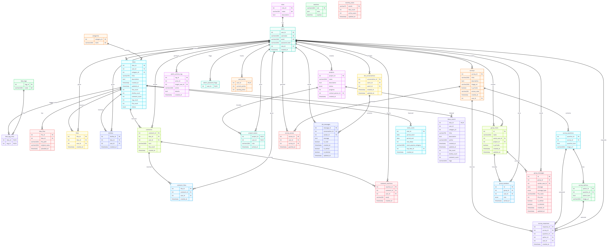

* `users` (user\_id, username, email, password\_hash, role\_id, created\_at)
* `roles` (role\_id, name, description)
* `ideas` (idea\_id, user\_id, category\_id, title, description, created\_at, updated\_at, like\_count, dislike\_count, comment\_count, status, tag\_count, file\_count)
* `ideas_search` (idea\_id, title, description, author, updated\_at) – Aria-Engine für Fulltext-Suche
* `categories` (category\_id, name)
* `idea_tags` (tag\_id, name)
* `idea_tag_links` (idea\_id, tag\_id)
* `idea_files` (file\_id, idea\_id, file\_path, original\_name, uploaded\_at)
* `likes` (like\_id, idea\_id, user\_id, created\_at)
* `dislikes` (dislike\_id, idea\_id, user\_id, created\_at)
* `comments` (comment\_id, idea\_id, user\_id, text, like\_count, created\_at)
* `comment_likes` (like\_id, comment\_id, user\_id, created\_at)
* `comment_reactions` (reaction\_id, comment\_id, user\_id, emoji, created\_at)
* `projects` (project\_id, name, description, status, progress, contact\_person\_id, created\_at)
* `project_teams` (project\_id, user\_id, role, joined\_at)
* `surveys` (survey\_id, title, description, image\_url, is\_private, access\_code, created\_at, user\_id)
* `survey_questions` (question\_id, survey\_id, question\_text, image\_url)
* `survey_options` (option\_id, question\_id, option\_text, image\_url)
* `survey_responses` (response\_id, survey\_id, question\_id, option\_id, user\_id, created\_at)
* `survey_access` (access\_id, user\_id, survey\_id, granted\_at)
* `stats_cache` (stat\_id, period\_start, period\_end, new\_ideas, most\_popular\_category, top\_idea\_id, created\_at)
* `dm_conversations` (conversation\_id, user1\_id, user2\_id, created\_at, updated\_at)
* `dm_messages` (message\_id, conversation\_id, sender\_id, message, is\_read, created\_at)
* `admin_actions_log` (log\_id, actor\_id, target\_user\_id, action, details, created\_at)
* `user_points` (user\_id, current\_points, pending\_delta)
* `schema_migrations` (id, name, applied\_at)

### 7.5 CSS-Architektur

* **Basis-Theme:** `public/css/style.css` definiert Farbvariablen (Light/Dark), Buttons, Header/Footer, Navigation, globale Form-Styles, Auth-/Account-Grundlayout sowie Utilities. Alle Seiten erben hier Theme-Variablen (`--bg`, `--text`, `--primary`, `--accent`).
* **Header-Layout:** Der Header ist als `sticky` (oder `fixed` je nach Konfiguration) implementiert, um eine konsistente Navigation zu ermöglichen. In Version 1.1.0 wurde das Layout optimiert, um unerwünschte Abstände (Margins) zu vermeiden, die den Seiteninhalt verschieben könnten.
* **Seitenspezifisch:** Pro Seite Layout-/Styling-Dateien, z.B. `auth.css`, `account.css`, `adminPage.css`, `dashboard.css`, `ideas.css`, `projects.css`, `dms.css`, `survey*.css`. Diese ergänzen Layout-Grids, Tabellen, Karten oder Spezialfarben, lassen aber die Grund-Theme-Variablen unangetastet.
* **Prinzip:** Globale Farb-/Typo-Definitionen in `style.css` + modulare Page-Styles; so bleiben Light/Dark konsistent, während jede Seite eigenes Layout bekommt.

### 7.6 Skalierbarkeit & Performance-Architektur

Um das System für zehntausende Ideen und Nutzer zu rüsten, wurden spezifische Architektur-Entscheidungen getroffen:

1. **SQL-Fulltext-Suche & Aria-Index:**
   * **Aria-Suchtabelle:** Die Anwendung nutzt eine dedizierte Aria-Tabelle (`ideas_search`), die speziell für Fulltext-Suchen optimiert ist. Aria bietet im Vergleich zu InnoDB oft schnellere Lesezugriffe bei Fulltext-Indizes.
   * **Echtzeit-Synchronisation:** Ein MariaDB-Event (`ideas_search_upsert`) spiegelt Änderungen jede Sekunde in den Suchindex. Ein `AFTER DELETE`-Trigger garantiert, dass Löschungen sofort wirksam werden.
  * **Fulltext-Modus (skalierbar):** Für Suchanfragen auf der Ideas-Seite verwendet die Anwendung MariaDB-FULLTEXT-Indizes auf der Aria-Tabelle mit SQL-basiertem Ranking für Titel, Autor und Beschreibung. Ein separater Fuzzy-/Fuse-Pfad ist dort derzeit nicht aktiv.
2. **Suchraum‑Capping:**
  * Für nicht suchende Listen mit nicht-globalen Sortierungen wird die interne Vorauswahl serverseitig begrenzt; `MAX_INNER_LIMIT` (1000) verhindert dabei unnötig breite Vorselektionen vor dem Enrichment.
   * Die Sortier‑Optionen können mit dem **Global-Toggle** kombiniert werden. Wenn der Toggle aktiviert ist, wird im Backend auf die `all_*`-Varianten der Sortierung umgeschaltet; Suchanfragen bleiben dabei im SQL-Fulltext-Pfad.
3. **Gewichtetes Ranking:**
  * Titel-/Autor-Suchen nutzen SQL-Ranking mit Exact-Match-, Prefix- und Fulltext-Komponenten.
  * Der Beschreibungspfad nutzt den Fulltext-Index der Beschreibung und ergänzt Tags als einfaches Fallback-Signal.
4. **Batch-Enrichment:**
   * Anstatt für jede Idee einzeln Tags, Likes und Dateien abzufragen (N+1 Problem), werden alle Daten für die sichtbare Seite (50 Items) in einem einzigen Batch-Query geladen und im Speicher zugeordnet.
5. **Lazy Loading von Kommentaren:**
   * Kommentare werden erst beim Expandieren einer Karte via HTMX nachgeladen. Dies reduziert die initiale Datenlast pro Seitenaufruf um bis zu 90%.

### 7.7 Architektur-Philosophie: Server-first & Single Source of Truth

Die Anwendung folgt einem bewusst server-zentrierten Architekturprinzip: Die Daten und die Geschäftslogik leben eindeutig auf dem Server (Datenbank + Express‑Router). Die UI wird primär serverseitig gerendert (EJS) und mit gezielten, progressiven Client‑Erweiterungen (HTMX, kleine Vanilla‑JS‑Skripte) ergänzt.

Kurz gefasst:

- **Single Source of Truth:** Alle Zustandsentscheidungen (Autorisierung, Validierung, Punktevergabe, Ranking, Zähler) werden auf dem Server getroffen. Clients fordern gerendertes HTML oder kleine JSON‑Payloads an; sie halten keine eigene, langlebige Kopie des System‑Zustands.
- **Progressive Enhancement mit HTMX:** Statt einer monolithischen SPA werden kleine, gezielte HTMX‑Requests genutzt, um Partials nachzuladen oder Aktionen (Like, Comment, Partial /chunk) durchzuführen. Dadurch entfallen viele Synchronisationsprobleme, die bei clientseitigen State‑Stores (Redux/MobX) auftreten.

Vorteile dieser Philosophie:

- **Konsistenz & Sicherheit:** Business‑Rules sind zentral implementiert; keine Duplikate von Validierungs- oder Autorisierungslogik auf dem Client.
- **Einfachere Tests & Debugging:** Templates + Server‑Logs bieten klar nachvollziehbare Abläufe; SSE/long‑polling zeigt Änderungen am Server direkt im Client.
- **Geringere Wartungskosten:** Keine umfangreiche JS‑Build‑Toolchain oder globale Client‑State‑Synchronisation notwendig; geringere Gefahr von „second source of truth“-Bugs.

- - -

## 8. Installation / Inbetriebnahme (lokal)

### 8.1 Voraussetzungen

* **Node.js:** >= 18 (empfohlen: LTS) – dies ist die Standardlaufzeit.
* **npm:** passend zur Node-Version.
* **Bun:** optional; nutzt dieselben Skripte wie npm (siehe Kapitel 5.4).
* **MariaDB:** Version 12.1; Download: https://mariadb.org/download/?t=mariadb&m=12.1 (Installer für Windows, macOS, Linux vorhanden).
* **Dependencies (Stand 2026-01-11):** `@faker-js/faker@10.2.0`, `argon2@0.44.0`, `body-parser@2.2.2`, `dotenv@16.0.0`, `ejs@3.1.10`, `express@5.2.1`, `express-rate-limit@^8.3.1`, `express-session@1.18.2`, `fuse.js@7.1.0`, `ioredis@5.9.2`, `mariadb@3.4.5`, `multer@^2.1.1`, `pm2@^6.0.14`, `uuid@13.0.0`; DevDependencies: `esbuild@^0.27.3`, `jsdoc@4.0.5`, `nodemon@3.1.14`.

Hinweis zur Umgebung: Die Anwendung liest Datenbankverbindungsinformationen aus Umgebungsvariablen (`DB_HOST`, `DB_USER`, `DB_PASSWORD`, `DB_NAME`). Erstellen Sie vor dem Start eine `.env`-Datei (siehe `.env.example`) oder exportieren Sie die Variablen in Ihrer Shell. Wenn Sie `bun` zum Starten verwenden, lädt die Anwendung die `.env` automatisch, weil `dotenv` beim Start geladen wird.

### 8.2 Datenbank einrichten

1. MariaDB starten (Port 3306 frei halten).

2. Optional ENV Variablen setzen (Shell oder `.env`):
   
   * `DB_HOST` (default: `localhost`)
   * `DB_USER` (default: `root`)
   * `DB_PASSWORD` (default: `""`)
   * `DB_NAME` (default: `ideaboard`)
   
   *Hinweis:* Die Anwendung nutzt intelligente Fallbacks. Wenn keine Umgebungsvariablen definiert sind, wird automatisch versucht, eine Verbindung zu `localhost` als `root` ohne Passwort herzustellen. Dies erleichtert die Inbetriebnahme in Standard-XAMPP-Umgebungen.

3. Datenbank & Schema:
   
   * DB wird automatisch erstellt (`config/db.js`)
   * Schema/Seeding über den SQL-Migrationsrunner: `npm run migrate` oder `bun run migrate` (liest `migrations/*.sql`, Baseline `0000_baseline.sql`, protokolliert in `schema_migrations`).
   * **Wichtig:** Stellen Sie sicher, dass der MariaDB Event-Scheduler aktiviert ist (`SET GLOBAL event_scheduler = ON;`), damit die Such-Synchronisation funktioniert.

### 8.3 .1 MariaDB installieren (Kurzcheck)

Für lokale Tests oder Entwicklungsmaschinen installieren Sie MariaDB 12.1 über die offizielle Seite: https://mariadb.org/download/?t=mariadb&m=12.1. Auf Windows steht ein Installer bereit. Für die Jury empfiehlt sich die native Installation.

Oder installieren Sie nativ (Windows/macOS/Linux) und starten den Server. Anschließend per CLI (mysql) eine Datenbank und einen Benutzer anlegen:

```sql
-- im mysql-Client ausführen:
CREATE DATABASE ideaboard;
CREATE USER 'ideaboard'@'localhost' IDENTIFIED BY 'securepassword';
GRANT ALL PRIVILEGES ON ideaboard.* TO 'ideaboard'@'localhost';
FLUSH PRIVILEGES;
SET GLOBAL event_scheduler = ON;
```

Tragen Sie die Zugangsdaten in `.env` ein (siehe `.env.example`) bevor Sie Migrationen ausführen.

### 8.4 App starten

0. Node installieren:
   
   * [https://nodejs.org/en/download](https://nodejs.org/en/download)

1. Dependencies:
   
   ```bash
   npm install
   # nur wenn nicht vorhanden. Sonst könnten Versionen sich änderen.
   ```
   
   > Hinweis: Die im ZIP enthaltenen `node_modules` entsprechen dem zuletzt getesteten Setup. Bei einer erneuten Ausführung von `npm install` können neuere, semver-kompatible Versionen installiert werden, die ggf. abweichendes Laufzeitverhalten zeigen. Um eine bestimmte Umgebung zu reproduzieren, nutze fixe Versionsangaben in `package.json` oder die Lockdatei `bun.lock`/`package-lock.json`.

2. Datenbank initialisieren (erstellt automatisch die `ideaboard` DB beim ersten Start):
   
   ```bash
   npm run devStart
   # Server kurz starten lassen (DB wird erstellt), dann mit Ctrl+C stoppen
   ```

3. Schema aufbauen (Baseline + neue Migrationen):
   
   ```bash
   npm run migrate
   ```

4. Start (Entwicklungsmodus mit Auto-Reload):
   
   Abhängig von Ihrer Laufzeit wählen Sie eines der folgenden Start-Workflows:
   
   Dependencies installieren:
   
   ```bash
   # mit npm (Node.js)
   npm install
   
   # oder mit Bun
   bun install
   ```
   
   Datenbank-Migrationen / Seeding:
   
   ```bash
   # Migrationen ausführen
   npm run migrate
   # oder mit Bun
   bun run migrate
   
   # optional: Testdaten einfügen
   npm run seed
   # oder
   bun run seed
   ```
   
   Entwicklung starten:
   
   ```bash
   # Node mit nodemon (empfohlen für Node-Entwicklung)
   npm run devStart
   
   # Bun: verwendet das vorhandene package.json script `bunStart`
   bun run bunStart
   
   # Produktion / einfacher Start (Node)
   npm start
   ```

5. Browser:
   
   * [http://localhost:3000](http://localhost:3000)
  * Im Caddy-Betrieb: einfach `localhost` in die Adresszeile eingeben; Caddy uebernimmt die lokale HTTPS-Auslieferung.

<!-- Hinweis: Index-warmup scripts were removed from the recommended workflow. If you previously used warmup scripts, they are deprecated and not required for normal operation. -->

### 8.5 Alternative: Bun (optionale Laufzeit)

1. Bun installieren:
   
   * PowerShell: `irm bun.sh/install.ps1 | iex`
   * Linux/macOS: `curl -fsSL https://bun.sh/install | bash`
   * Universell per npm: `npm install -g bun` (falls der Installer gesperrt ist)

2. Abhängigkeiten: `bun install` (liest `package.json`, erzeugt `bun.lockb`; auch nutzen, wenn eine ZIP node\_modules enthält).

3. Datenbank initialisieren & Schema:
   
   ```bash
   bun run migrate
   ```

4. Start: 
   
   ```bash
   bun run bunStart
   # Nutzt bun --watch für sehr schnelle Reloads
   ```

- - -

## 9. Sicherheit, Authentifizierung & Rollen

* **Sessions & Auth:** `express-session`; Login/Registrierung in `routes/users.js`. Login-Attempts werden per eigenem Store mit gestaffelten Sperrzeiten (30 Min / 2h / 24h) begrenzt.
* **Passwörter:** `argon2id` Hash (Argon2 parameters used: memoryCost=65536 KB = 64 MB, timeCost=3, parallelism=1).
* **Rollenmodell:** Tabellen `roles` + `users.role_id`; Mapping im Login (`role_id → Admin/Projektleiter/Mitarbeiter`). Guards: `isLoggedIn` prüft Session, `isAdmin` erzwingt Admin-Zugriff.
* **Default-Admin + Setup:** Beim Start wird ein Default-Admin (ENV: `DEFAULT_ADMIN_USERNAME/EMAIL/PASSWORD`) angelegt, falls noch keiner existiert. Meldet sich der Default-Admin mit dem Default-Passwort an, wird er auf `/users/admin-setup` zum Passwortwechsel gezwungen.
* **Rate Limits & Input-Checks:** Login-Sperren, Kommentar-Länge (<=200), Emoji-Whitelist, Wochen-Like-Limit (3 Likes/Dislikes).
* **Uploads:** Ideen-Dateien werden unter `data/uploads/ideas` gespeichert (Limit 25 MB pro Datei; bei verfügbarem Master-Key verschlüsselt). Chat-Dateien liegen unter `data/uploads/chat` mit 10 MB Limit pro Datei.

- - -

## 10. Benutzerseiten (Basis: Auth, Account, Admin)

### 10.1 Auth-Seite (Login/Registrierung)

* **Routen:** `GET /users/auth` (Login-View, Redirect bei aktiver Session), `POST /users/auth` (Login inkl. Attempt-Sperren), `POST /users/register` (legt User an, Standardrolle „Mitarbeiter“).

* **Admin-Setup (Default-Admin):** `GET /users/admin-setup` und `POST /users/admin-setup` — wird verwendet, wenn ein Default-Admin sich mit dem Standard-Passwort anmeldet und zum Passwortwechsel gezwungen wird (geschützt durch `isLoggedIn` + `isAdmin`).

* **View:** `views/users/auth.ejs` (Flip-Card für Login/Registrierung). **CSS:** Basis in `style.css`; zusätzlich existiert `auth.css` für dediziertes Auth-Layout. **Client-JS/HTMX:** nicht genutzt; klassischer Form-POST.

* **Global JS:** `index.js` (Theme toggle, menu handling, auth flip card).

* **Validierung/Fehler:** falsches Passwort/Konto → Fehlermeldung; Sperrhinweis bei zu vielen Fehlversuchen (HTTP 429, Render der Auth-View).


### 10.2 Account-Seite

* **Routen:** `GET /users/account` (Session-Pflicht), `POST /users/account/update-username`, `POST /users/account/update-password`, `GET /users/logout`.

* **View:** `views/users/account.ejs` (zeigt Username/Rolle, Engagement-Punkte, Formulare für Name/Passwort, Logout-Link; Admins sehen Button „Zur Admin Seite")

* **CSS:** `style.css` + `account.css` (Layout/Grids für Konto). **Client-JS:** keiner.

* **Berechtigungen:** nur eingeloggte Nutzer; Passwortwechsel prüft das bestehende Passwort serverseitig.

* **Lazy-Punkte-Endpoint:** `GET /users/points` – liefert `text/plain` mit `current_points + pending_delta` (z. B. "50 (+5)") und committtet `pending_delta` asynchron nach dem Lesen (lazy-commit). Die Response ist bewusst `no-store` gecached, damit die UI immer den Pending-Wert sieht.

### 10.3 # Verwendete Services (`lib/services`)

- `lib/services/authService.js` — Auth/Register/Login Hilfen (Login, Registrierung, Session-Checks).
- `lib/services/userService.js` — Benutzerverwaltung & Suche (Profil-Updates, Suche, Account-Aktionen).
- `lib/services/pointsService.js` — Gamification / Punkte-Logik (Berechnung / lazy-Endpoints für Punkte).

### 10.4 Admin-Seite (Benutzerverwaltung)

* **Routen (geschützt):** `GET /adminPage` (Liste Nutzer + Rollen), `POST /adminPage/change-role` (setzt Rolle, schützt Hauptadmin ID=1), `POST /adminPage/delete-user` (löscht Nutzer, nicht Hauptadmin).
* **Middleware:** `isLoggedIn` + `isAdmin` in `routes/adminPage.js` erzwingen gültige Session und Rolle „Admin“.
* **View:** `views/adminPage/adminPage.ejs` (Tabelle mit Rollen-Dropdown + Lösch-Button). **CSS:** `style.css` + `adminPage.css` (Tabellenlayout, Tags, mobile Cards). **Client-JS/HTMX:** nicht im Einsatz; klassische Form-Posts.
* **DB:** liest `users` + `roles`, schreibt `users.role_id` bzw. löscht Nutzer.
* **Audit-Logging:** Änderungen über die Admin-Seite werden in `admin_actions_log` protokolliert (actor\_id, target\_user\_id, action, details, created\_at). Einsehbar über `/adminPage/logs`.
* **Manuelle Punktevergabe:** `POST /adminPage/manual-points` erlaubt Admins die Zuordnung von `-50..+50` Punkten an Nutzer (schreibt in `user_points.pending_delta`) und wird im `admin_actions_log` protokolliert.

### 10.5 # Verwendete Services (`lib/services`)

- `lib/services/adminService.js` — Admin-Funktionalitäten (Rollenwechsel, Logs, Admin-spezifische Aktionen).
- `lib/services/userService.js` — Benutzerverwaltung & Suche (Löschen, Rollen-Änderung, Lookup).
- `lib/services/pointsService.js` — Gamification / Punkte-Logik (manuelle Punktevergabe, Pending-Deltas).

- - -

## 11. Seite: Ideen (/ideas) – Kernfunktion

* **Zweck/User-Story:** Ideen erfassen, filtern, liken/disliken (je 3/Woche, XOR), kommentieren (<=200), mit Emojis reagieren, Dateien anhängen, alles mit Live-Updates (SSE / Server-Sent Events).

* **Haupt-View & Assets:** `views/ideas/ideas.ejs` (bindet `_list`, Create-Dialog, Edit-Modal-Container); **CSS:** `style.css` + `ideas.css`; **JS:** `ideasClient.js` (Expand/Hash, Modal, Emoji-Popover, Scroll-Persist, Einzelkarte laden, Filter-Interaktion), `ideasLive.js` (SSE + Smart-Refresh). **HTMX:** Filter-Form, Infinite Scroll, Stats/Comments/Edits/Status/Tags/Files.
  
  * `ideasClient.js`: Verwaltet Karten expandieren/zuklappen, Hash-Navigation, Modal-Verwaltung, Emoji-Popovers, Scroll-Persistenz.
  * Filter, Suchzustand und HTMX-Submits werden direkt im Seiten-Setup und den Formular-Handlern orchestriert; es gibt kein separates `ideas-filter.js` Bundle mehr.
  * `ideasLive.js`: Verwaltet SSE‑Verbindungen für Live‑Updates, intelligentes Refresh von Karten/Kommentaren/Stats inkl. Race‑Condition‑Schutz.

* **Zentrale Helper (serverseitig, routes/ideas.js):**
  
  * `loadCommentsWithReactions(ideaId, userId)`: holt Kommentare inkl. Likes-Status, Reaction-Aggregate (top 3, total) + userReaction.
  * `renderIdeaCard(ideaId, userId, categories)`: baut komplette Card-Daten (Counts, Tags, Files, Comments, remainingLikes/Dislikes, isOwner) für Partials.
  * `liveUpdates` (lib): `recordChange` (protokolliert Änderungen mit Version), `registerSSEWaiter` (für persistente SSE‑Streams), `waitForChanges` (interne Waiter für SSE‑Dispatch).

* **Routenüberblick (Auszug, inkl. Partials/HTMX):**
  
  | Methode/Route                                                                                           | Zweck                                                                   | View/Partial                                               | Besonderheiten                                                                         |
  | ------------------------------------------------------------------------------------------------------- | ----------------------------------------------------------------------- | ---------------------------------------------------------- | -------------------------------------------------------------------------------------- |
  | GET `/ideas`                                                                                            | Hauptseite, Filter (q, category\_id, tags, page), Paginate 50           | `ideas.ejs` / `_list`                                      | SQL-Listenpfad bzw. SQL-Fulltext-Suche, Tag-Filter, Counts, Files, remainingLikes/Dislikes |
  | GET `/ideas/chunk`                                                                                      | Schnelle Pagination für große Mengen; JSON-API (siehe `partial_json=1`) | JSON / `ideas/_list` (bei `partial_json=1` enthält `html`) | liefert `html`, `nextPage` und `total`; nutzt dieselbe SQL-/Fulltext-Filterlogik wie `/ideas` |
  | GET `/ideas/partial`                                                                                    | Refresh/Infinite Scroll                                                 | `_list.ejs`                                                | gleiche Filterlogik wie oben                                                           |
  | GET `/ideas/:id/card`                                                                                   | Einzelkarte für Refresh/Deep-Link                                       | `_list.ejs` (1 Card)                                       | nutzt `renderIdeaCard`                                                                 |
  | NOTE: `/ideas/latest-card` removed. Use `/ideas/:id/card` with the specific `idea_id` for live inserts. |                                                                         |                                                            |                                                                                        |
  | GET `/ideas/:id/stats`                                                                                  | Nur Stats                                                               | `_idea-stats.ejs`                                          | HX-Target in Card                                                                      |
  | GET `/ideas/:id/comments`                                                                               | Kommentar-Refresh                                                       | `_comments-section.ejs`                                    | HX-Trigger `refresh_comments_<id>`                                                     |
  | GET `/ideas/updates?since`                                                                              | SSE                                                                     | JSON / Stream                                              | `liveUpdates.registerSSEWaiter`                                                        |
  | POST `/ideas`                                                                                           | Idee anlegen                                                            | Redirect                                                   | Tags+Files, 25MB Limit                                                                 |
  | POST `/ideas/:id/edit`                                                                                  | Titel/Beschr./Kategorie ändern                                          | `_idea-card`                                               | only Owner                                                                             |
  | POST `/ideas/:id/tags`                                                                                  | Tags setzen/ergänzen                                                    | `_idea-card`                                               | de-dupliziert via UPSERT                                                               |
  | POST `/ideas/:id/files`                                                                                 | Datei hinzufügen                                                        | `_idea-card`                                               | only Owner, 25MB                                                                       |
  | POST `/ideas/:id/delete`                                                                                | Idee löschen                                                            | Redirect                                                   | Owner oder Admin                                                                       |
  | POST `/ideas/:id/status`                                                                                | Status ändern                                                           | `_idea-card`                                               | nur Admin, nicht eigene Idee                                                           |
  | POST `/ideas/:id/comments`                                                                              | Kommentar anlegen                                                       | `_comments-section`                                        | <=200 Zeichen                                                                          |
  | POST `/ideas/comment-likes/:commentId/react`                                                                    | Emoji auf Kommentar                                                     | `_comments-section`                                        | Whitelist Emojis, toggelt/ändert                                                       |
  | POST `/ideas/comment-likes/:id/like?idea_id=...`                                                                | Kommentar-Like (comments-likes.js)                                      | `_comments-section`                                        | Transaktion, Session commentLikes                                                      |
  | POST `/ideas/:id/like`                                                                                  | Idee liken                                                              | `_idea-stats`                                              | XOR zu Dislike, Wochenlimit 3, HX-Trigger                                              |
  | POST `/ideas/:id/dislike`                                                                               | Idee disliken                                                           | `_idea-stats`                                              | XOR zu Like, Wochenlimit 3                                                             |
  | GET `/ideas/:id/modal`                                                                                  | Edit-Modal laden                                                        | `_idea-modal.ejs`                                          | Owner oder Admin (nicht Owner für Status)                                              |
  | GET `/ideas/updates`                                                                                    | SSE Endpoint                                                            | Stream / JSON                                              | liefert `version` + `changes`                                                          |

* **Templates/Partials (views/ideas):** `ideas.ejs` (Filter, Modal), `_list` (Karten + intersect-Loader), `_idea-card` (Tags, Files, Stats, expand -> Comments), `_idea-stats` (Like/Dislike XOR, Limit-Fehler), `_comments-section` + `_comment-item` (Emoji-Popover, Kommentar-Like, DM-Link), `_idea-modal` (Edit/Tags/Files, Admin-Status, Delete).

### 11.1 Verwendete Services (`lib/services`)

Die folgenden Services werden speziell von der Ideas-Route genutzt (nur kurze Nennung, nicht inhaltlich erklärt):

- `lib/services/ideasService.js` — Kern-Business-Logik für Ideen (create/edit/delete, orchestriert Tags/Files/Points).
- `lib/services/ideasCommentsService.js` — Kommentar-Handling (create/list/react) — direkt in `routes/comments.js` und `routes/comments-likes.js` verwendet.
- `lib/services/ideasFilesService.js` — Datei-Uploads / Datei-Management für Ideen.
- `lib/services/ideasSearchService.js` — SQL-/Fulltext-Suchpipeline für `/ideas`.
- `lib/services/ideasStatsService.js` — Statistische Helfer / Wochenlimits (z. B. verbleibende Likes).
- `lib/services/ideasTagsService.js` — Tag-Management (intern von `ideasService` verwendet).
- `lib/services/ideasEnrichmentService.js` — Enrichment / Normalisierung (intern genutzt beim Batch-Enrich).
- `lib/services/reactionsService.js` — Reactions / Emoji-Whitelist Helper.

  
  * **Client-Logik/UX:** `ideasClient` hält Expanded-Card, Hash-Deep-Link, lädt Einzelkarte wenn nicht sichtbar; Emoji-Popover wird für Positionierung zu `<body>` geportalt; Scroll-Persist für Comments; HTMX-Intercept markiert lokale Aktionen (`window.localActionCooldowns`) um Doppel-Refresh/Race-Conditions zu vermeiden. `ideasLive` unterscheidet Aktionen (`new_idea`, `comment_added/reacted`, `idea_edited/file_uploaded/tags_updated/status_changed`, `idea_liked/disliked`, `idea_deleted`) und aktualisiert gezielt (Card/Comments/Stats) via SSE. Die Such-Pipeline der Ideas-Seite bleibt dabei SQL-/Fulltext-basiert.
  * **Load More & HTMX-Zuverlaessigkeit:** Der `/ideas/chunk`-Flow liefert bei `partial_json=1` JSON mit `html`, `nextPage` und `total`. Der Client `loadMoreChunk()` fuegt die DOM-Knoten selbst ein, ueberspringt bereits vorhandene `.idea-card[data-id]`-Elemente still und ruft danach `htmx.process(node)` fuer eingefuegte Knoten auf. Das reduziert doppelte IDs und stabilisiert HTMX-Swaps bei parallelen Updates.
  * **Tag- & Datei-UX (Kurz):**
    - Mehrere Tags können in einem Schritt angelegt werden (Komma-separiert im Tags-Feld).
    - Tags lassen sich im Edit-Modal per Long-Press (ca. 0.5s) löschen: das Tag zeigt eine kurze Skalierung/Hintergrund-Animation und das Modal wird danach neu geladen, sodass das Tag in der UI verschwindet.
    - Dateien zeigen im Edit-Modal einen kleinen "✕"-Button zum Entfernen; Löschen erfordert eine Bestätigung und das Modal wird nach erfolgreichem Entfernen neu geladen. Datei-Uploads sind weiterhin ein Datei-Submit pro Formular (kein Multi-File-Submit).

* **Filter- & Sort-Pipeline:** Das HTMX-Formular auf `/ideas` bietet optimierte Steuerungen (Freitextsuche `q`, Kategorie, Tags, Sortierung); Debounce und Formular-Interaktion werden clientseitig im bestehenden Ideen-Frontend gehandhabt.
  
  * **Such-Logik:** Die Suche auf `/ideas` nutzt aktuell keinen separaten Fuse-/Fuzzy-Pfad. Bei gesetztem `q` wird immer die SQL-Fulltext-Suche ueber `ideas_search` verwendet; Kategorie-, Tag- und Owner-Filter werden serverseitig als Vorfilter angewendet.
  
  * **Ranking & Scope:** Titel-/Autor-Suchen sowie der Description-Only-Modus laufen ueber `executeFulltextSearch`. `search_scope` steuert dabei, ob eher Titel/Autor oder Beschreibung gewichtet abgefragt werden.
  
  * **Performance‑Capping / Prefiltering:** Fuer Listen ohne Suchbegriff und fuer nicht-globale Sortierfaelle wird die interne Vorselektion begrenzt; `MAX_INNER_LIMIT` (1000) verhindert uebergrosse Zwischenmengen vor dem Batch-Enrichment.
  
  * **Sortierung:** Unterstützt `latest`, `all_latest` (ohne 9999er Limit), `oldest`, `likes`, `comments` und `dislikes`. Validierung erfolgt gegen eine `SORT_WHITELIST`.
  
  * **Beispiel-Request & Parameter:** `GET /ideas?q=Suchbegriff&category_id=3&sort=likes&page=1&per_page=50` — Parameter:
    
    - `q`: Freitextsuche ueber den SQL-Fulltext-Index
    - `category_id`: Kategorie-Filter (optional; reduziert die Prefilter-Menge)
    - `sort`: einer von `latest|all_latest|oldest|likes|comments|dislikes`
    - `page` / `per_page`: Pagination (Standard: 50)
    - `search_scope`: schaltet zwischen Standardsuche und Description-Fokus um
    - `debug_search=1`: aktiviert Suchdiagnose fuer die Route

* **Lazy Comments:** Die globale Suche lädt nur Ideen-Metadaten (inklusive Tags, Counts, Dateien, Statistiken), nicht aber Kommentare. Erst wenn die Kommentarsektion einer Karte auf `GET /ideas/:id/comments` anliegt, ruft der Server `loadCommentsWithReactions` auf, aggregiert Likes und Emojis und liefert `_comments-section.ejs`. Dadurch bleibt die Filter-/Sortier-Performance hoch, da Kommentare nur bei Bedarf (z. B. durch den User beim Öffnen einer Idee) geladen und nur dann zusätzliche Datenbank-Queries ausgeführt werden.

* **Daten & Regeln:** Tabellen `ideas`, `idea_tags`, `idea_tag_links`, `idea_files`, `likes`, `dislikes`, `comments`, `comment_likes`, `comment_reactions`, `categories`, `users`.
  
  - Likes/Dislikes sind gegenseitig exklusiv (XOR) und je Nutzer 3/Woche (rollierendes Fenster, serverseitig geprüft).
  - Implementation (Like‑Limit): Der Server zählt die Likes aus der Tabelle `likes` mit einer rolling‑7‑day Abfrage, z. B. `SELECT COUNT(*) AS cnt FROM likes WHERE user_id = ? AND created_at >= DATE_SUB(NOW(), INTERVAL 7 DAY)` und verhindert Inserts bei Erreichen des Limits.
  - Kommentare: maximale Länge 200 Zeichen (serverseitig validiert).
  - Emoji‑Reaktionen: werden gegen eine serverseitige Whitelist geprüft, nur zugelassene Emojis werden in `comment_reactions` gespeichert.
  - Upload: maximal 25MB pro Datei; Ablage in `data/uploads/ideas`, Dateireferenz in `idea_files`, Download über die geschützte Download-Route.
  * **Redundante Zähler:** Die `ideas`-Tabelle enthält zusätzliche Spalten `tag_count` und `file_count` (INT DEFAULT 0), die häufige COUNT(*)-Abfragen vermeiden sollen. Bei bestehenden Datenbanken sind ALTER + Backfill nötig (siehe Migration `migrations/0000_baseline.sql`).

* **Rollen/Berechtigungen & UI:** `router.use(isLoggedIn)` → nur eingeloggte. Inhalte bearbeiten (Titel/Beschreibung/Tags/Files) nur Owner; Admin darf Status ändern (nicht bei eigener Idee) und darf löschen, aber keine inhaltliche Bearbeitung. Status-Badge im Card-Header wird dem Owner gezeigt; im Edit-Modal sieht der Admin das Status-Feld, Owner nicht. Delete: Admin oder Owner. Kommentare/Likes/Dislikes/Reactions nur eingeloggte. Idee anlegen: jeder eingeloggte.

* **DM/Feedback-Links:** In `_idea-card` sehen Admins bei fremden Ideen einen „Feedback geben“-Link (öffnet DM-Suche mit Author-Namen vorbelegt); in `_comment-item` hat jeder Kommentar einen DM-Link zum Kommentierenden. Emoji-Popover bietet Reaktionswahl (Whitelist) direkt am Kommentar.

* **Edge Cases & Fehler:** Kommentar leer/zu lang → 400; Like/Dislike-Limit → Stats-Partial mit Fehlermeldung; Idee/Kommentar nicht gefunden → 404; unberechtigt → 403; Status-Change blockiert für eigene Idee des Admins; Upload fehlt → 400. Verbindungsabbrüche → Reconnect/Backoff.

* **CSS & Screens:** `ideas.css` für Grid, Karten (expanded full-width), Animationen, Popover, Modals; nutzt Theme-Variablen aus `style.css`. Screenshots: Filter+Liste, Infinite-Scroll-Trigger, expandierte Idee mit Comments/Emoji/Like-Limit, Edit-Modal (Owner/Admin), Admin-Status-Form, Create-Dialog.

- - -

* ## 9\. Seite: Projekte (/projects)

* **Zweck/User-Story:** Projekte mit Status (Konzeption/Umsetzung/Abgeschlossen), Fortschritt, Ansprechpartner und Kontaktmöglichkeiten verwalten; Admins und Projektleiter können Projekte anlegen, Admin/zugewiesener Projektleiter bearbeiten oder löschen.

* **Haupt-View:** `views/projects/projects.ejs`. **CSS:** `style.css` + `projects.css`. **Client-JS:** `public/js/projectsClient.js` (Modal-Handling, clearSearch). **HTMX:** Fragment-System mit Server-seitiger Suche/Filterung + Infinite Scroll.
  
  * **HTMX Fragment-System:** Die Projektliste wird über `/projects/fragment` geladen. Dies ermöglicht eine nahtlose Integration von Suche und Filterung ohne Seiten-Reload.
  * **Server-seitige Suche/Filter:** Nutzt Fuse.js auf dem Server für unscharfe Suche in Projektnamen und Ansprechpartnern. Filterung nach Status (Konzeption/Umsetzung/Abgeschlossen) erfolgt ebenfalls serverseitig.
  * **Infinite Scroll:** Projekte werden beim Scrollen automatisch nachgeladen (`hx-trigger="intersect once"`), sofern weitere Seiten existieren.
  * **URL-State-Sync:** Filter, Suche und Seite werden in der URL gespiegelt (`hx-push-url="true"`), was die Nutzung der Browser-Back/Forward-Buttons ermöglicht.

* **Routen (routes/projects.js):**
  
  | Route                        | Zweck                                                | Response     | Templates/Logik                                   |
  | ---------------------------- | ---------------------------------------------------- | ------------ | ------------------------------------------------- |
  | `GET /projects`              | Hauptseite, lädt Kontakt-Optionen, prüft `canCreate` | HTML full    | `projects.ejs`; Auth-Pflicht                      |
  | `GET /projects/fragment`     | Gefilterte/paginierte Kartenliste (Status, Suche)    | HTML Partial | `_list.ejs`; Fuse.js Suche; Infinite Scroll Logik |
  | `GET /projects/users/search` | Nutzersuche (für Team-Modal)                         | JSON         | Limitiert auf 10 Treffer; nutzt LIKE/echte Suche  |
  | `POST /projects`             | Projekt erstellen (Admin + Projektleiter)            | Redirect     | Validiert Ansprechpartner; progress clamp 0–100   |
  | `POST /projects/:id/edit`    | Projekt bearbeiten                                   | Redirect     | Admin oder zuständiger PL                         |
  | `POST /projects/:id/delete`  | Projekt löschen                                      | Redirect     | Admin oder zuständiger PL                         |

* **Templates/Partials:**
  
  * `projects.ejs`: Header, Filter-Bar (Status-Buttons + Suche), Container `#projectsList` mit `hx-trigger="load"`.
  * `_list.ejs`: Rendert Projektkarten und den Infinite-Scroll-Trigger am Ende der Liste.

* **Rollen/Berechtigungen:** Auth-Pflicht; Admin: create/edit/delete; Projektleiter: create sowie edit/delete nur eigene Projekte; Mitarbeiter: read-only.

* **Team-API (Kurz):** `GET /projects/:id/team` (JSON), `POST /projects/:id/team/add` (add user), `POST /projects/:id/team/remove/:userId` (remove user). Frontend nutzt diese Endpunkte für das Team‑Modal und Realtime-Suchen.

### 11.2 # Verwendete Services (`lib/services`)

- `lib/services/projectService.js` — Projekt-CRUD & Team-Management (Erstellen, Team-API, Edit/Delete-Logik).
- `lib/services/categoriesService.js` — Kategorie-CRUD / Lookup (Status/Kategorien-Lookups in Filtern und Filter-Pipelines).

- - -

## 12. Seite: Umfragen (/surveys)

* **Zweck/User-Story:** Mitarbeitende nehmen an öffentlichen oder privaten Umfragen teil; Admins/Projektleiter erstellen neue Umfragen. Private Umfragen werden über Zugangscode geteilt.

* **Haupt-View:** `views/surveys/survey.ejs`. **CSS:** `survey.css`. **Client-JS:** `public/js/surveysClient.js` (clearSearch, URL-Sync). **HTMX:** Fragment-System mit Server-seitiger Suche/Filterung + Pagination.
  
  * **HTMX Fragment-System:** Die Umfragenliste wird über `/surveys/fragment` geladen.
  * **Server-seitige Suche/Filter:** Nutzt Fuse.js auf dem Server für unscharfe Suche in Titeln, Beschreibungen und Erstellern. Filterung nach Typ (Öffentlich/Privat/Meine).
  * **Pagination:** Klassische Pagination mit 10 Umfragen pro Seite. Behält Such- und Filterzustand bei.
  * **URL-State-Sync:** Volle Unterstützung für Browser-Historie und Back/Forward-Buttons.

* **Routen (routes/surveys.js):**
  
  | Route                             | Zweck                          | Validierung / Besonderheiten                   |
  | --------------------------------- | ------------------------------ | ---------------------------------------------- |
  | `GET /surveys`                    | Hauptseite mit Filter/Suche    | Auth-Pflicht; Shell für HTMX-Liste             |
  | `GET /surveys/fragment`           | Filter/Suche/Pagination (HTMX) | Fuse.js Suche; Pagination 10/Page              |
  | `GET /surveys/new`                | Formular zum Anlegen           | Nur Admin/Projektleiter                        |
  | `POST /surveys`                   | Umfrage erstellen              | Admin wählt öffentlich/privat; PL immer privat |
  | `POST /surveys/:id/delete-survey` | Löschen (HTMX)                 | Nur Owner oder Admin; entfernt Karte via HTMX  |
  | `POST /surveys/private`           | Zugangscode prüfen / gewähren  | schreibt in `survey_access` und redirect       |
  | `GET /surveys/:id`                | Detail & Teilnahmeformular     | Zugriffskontrolle (Code/Owner/Admin)           |
  | `POST /surveys/:id/vote`          | Stimmen speichern              | Einmalige Teilnahme; Punkte-System (+2/+3)     |
  | `GET /surveys/:id/results`        | Ergebnisansicht                | Balkendiagramme; eigene Stimme markiert        |

* **Rollen/Berechtigungen:** Auth-Pflicht. Erstellen: Admin + Projektleiter (PL immer privat). Lesen: Öffentlich für alle; Privat nur mit Code/Berechtigung. Löschen: Admin oder Owner.

### 12.1 # Verwendete Services (`lib/services`)

- `lib/services/surveyService.js` — Umfrage-Logik (Erstellen, Teilnahme, Private-Access Checks, Ergebnisse).
- `lib/services/pointsService.js` — Gamification / Punkte-Logik (Punktevergabe für Teilnahme, z. B. +2/+3).

- - -

## 13. Seite: DMs (/dms)

* **Zweck/User-Story:** 1:1-Nachrichten zwischen eingeloggten Nutzern; Posteingang mit letzter Nachricht/Unread-Anzahl, Suche, Chat mit **SSE (Server-Sent Events)** inkl. Lesebestätigung.

* **Haupt-Views & Assets:** Posteingang `views/dms/index.ejs`, Suche `views/dms/search.ejs`, Chat `views/dms/chat.ejs`; Partials `views/dms/partials/message_list.ejs` (Initial-Render) + `views/dms/partials/message_items.ejs` (Batch neuer Messages); Styles `public/css/dms.css` + `style.css`; JS `public/js/chatClient.js` (Scroll/Helpers) + `public/js/dmLive.js` (SSE).
  
  * `chatClient.js`: Verwaltet Auto-Scroll, Message-Container-Helpers, letzte Message-ID-Verfolgung, Deduplizierung von Nachrichten.
  * `dmLive.js`: Verwaltet die SSE‑Verbindung für neue Nachrichten und Lesebestätigungen.

* **Routen (routes/dms.js):**
  
  | Route                                                           | Zweck                                                       | Validierung / Besonderheiten                                                                                                |
  | --------------------------------------------------------------- | ----------------------------------------------------------- | --------------------------------------------------------------------------------------------------------------------------- |
  | `GET /dms`                                                      | Posteingang mit Conversations, letztem Text, `unread_count` | Auth-Pflicht (router.use); sortiert nach `updated_at`                                                                       |
  | `GET /dms/search`                                               | Nutzersuche (standardmäßig bis 20 Treffer)                  | Auth-Pflicht; blendet den angemeldeten Nutzer aus; HTMX-Partial oder Vollseite                                              |
  | `GET /dms/chat/:userId`                                         | Einzelchat aufrufen/erstellen                               | Auth-Pflicht; erstellt Conversation falls keine existiert; markiert ungelesene Messages als gelesen (triggert Read-Receipt) |
  | `GET /dms/direct/:userId`                                       | Direkte Weiterleitung in einen DM                           | erstellt/ermittelt Conversation und redirectet auf `/dms/chat/:userId`                                                      |
  | `GET /dms/chat-updates/:conversationId?afterId=…&readAfterId=…` | **SSE**: liefert neue Messages + Read-Receipts  | Stream (SSE); weckt Waiters bei neuen Daten                                                                                 |
  | `POST /dms/send`                                                | Nachricht senden                                            | gibt nur das HTML der neu gesendeten Message zurück; weckt SSE Waiters                                                     |
  | `GET /dms/chat/:conversationId/history`                         | Ältere Nachrichten nachladen                                | HTMX-History-Partial für Paging im Chat                                                                                     |
  | `POST /dms/edit`                                                | Eigene Nachricht bearbeiten                                 | nur Sender; benachrichtigt SSE-Marker                                                                                       |
  | `POST /dms/delete`                                              | Eigene Nachricht löschen                                    | nur Sender; benachrichtigt SSE-Marker                                                                                       |
  | `GET /dms/file/:conversationId/:filename`                       | Geschützter Dateidownload / Inline-Anzeige                  | Zugriff auf Conversation wird vor Dateiausgabe geprüft                                                                       |
  | `POST /dms/leave`                                               | Präsenz beim Verlassen reduzieren                           | JSON-Endpoint für Presence-Cleanup                                                                                           |

### 13.1 # Verwendete Services (`lib/services`)

- `lib/services/dmPresenceService.js` — DM-Präsenz / Online-Status (Anzeige, Last-Seen, Präsenz-API).
- `lib/services/dmMessagingService.js` — DM-Messaging-Logik (Konversationen, Senden, Pagination, Read-Receipts).
- `lib/services/dmFilesService.js` — Datei-Handling für DMs (Upload/Links/Previews).
- `lib/services/userService.js` — Benutzerlookup & Suche (Nutzer-Suche im Posteingang / Mention-Resolution).

* **Inkrementelle Updates:** Statt kompletter History werden neue Messages als HTML-Partial (`message_items.ejs`) an den Container angehängt.

* **File- & Image-Support (neu):** Der Chat unterstützt Dateianhänge und Bilder mit folgenden Details:
  
  - **Upload-Handling:** `multer` speichert Dateien unter `data/uploads/chat`. Die Route `POST /dms/send` nutzt `upload.array('file', 5)` mit maximal 5 Anhängen und 10 MB Limit pro Datei.
  
  - **Client-Integration:** `views/dms/chat.ejs` enthält ein verstecktes `<input type="file" id="chatFileInput" multiple>`; Drag&Drop und Klick-Interaktion werden durch `public/js/chatDragnDrop.js` gesteuert und zeigen eine Vorschau im Container `#chatUploadPreview`.
  
  - **Image-Handling:** Bilder werden als Inline-Preview (``) in `views/dms/partials/message_items.ejs` gerendert; Nicht-Bild-Dateien erscheinen als Datei-Links mit Größe.
  
  - **Partial-Render:** Der Server liefert die neue Message als HTML-Partial (Partial `message_items`) zurück, sodass HTMX / Client den Chat ohne Full-Reload aktualisieren kann.
  
  - **Mobile: Sichtbarer Mini-Upload-Button :** Für mobile Nutzer wurde ein kleiner, klickbarer Upload-Button ergänzt, der die bereits vorhandene Upload-Logik verwendet:
    
    - Template: `views/dms/chat.ejs` enthält jetzt einen sichtbaren Button `#chatFileButton` (Klasse `mini-file-btn`), der den versteckten Input `#chatFileInput` auslöst.
    - Preview: Ausgewählte Dateinamen werden im Element `#chatUploadPreview` angezeigt; die Form verwendet weiterhin `hx-encoding="multipart/form-data"`, sodass HTMX den Upload wie gewohnt als FormData behandelt.
    - Server: Die Route `POST /dms/send` verarbeitet Dateien mit `multer` (`upload.array('file', 5)`) — keine serverseitigen Änderungen am Upload-Handling sind erforderlich.
    - Styling: Optionales CSS-Feintuning kann in `public/css/dms.css` unter `.mini-file-btn` vorgenommen werden.

* **Lesebestätigung (✓/✓✓):** Wenn der Empfänger Messages liest, wird `is_read` gesetzt und der Sender bekommt per SSE die `lastReadId`, die clientseitig die Ticks aktualisiert.


- - -

## 14. Seite: Dashboard (/dashboard)

* **Zweck/User-Story:** Zentrale Übersichtsseite mit Statistiken, Top-Ideen der Woche, Projektstatus, aktive Nutzer und beliebte Kategorien für schnelle Einblicke.

* **Haupt-View:** `views/dashboard/dashboard.ejs`. **CSS:** `style.css` + `dashboard.css`.

* **Client-JS / HTMX:** Es gibt keine dedizierten, großen Dashboard-JavaScript-Bundles; statische Teile werden serverseitig gerendert. Widgets werden jedoch lazy via HTMX‑Platzhalter nachgeladen (siehe `views/dashboard/partials/` und `routes/dashboard.js`).

* **Routen (routes/dashboard.js):**
  
  | Route                                     | Zweck                                                                 | Antwort / gerenderte Template (Code)                                             |
  | ----------------------------------------- | --------------------------------------------------------------------- | -------------------------------------------------------------------------------- |
  | `GET /dashboard`                          | Hauptseite (Shell)                                                    | `views/dashboard/dashboard.ejs` (full HTML)                                      |
  | `GET /dashboard/widgets/metrics`          | KPI‑Widget (neue Ideen, aktive User, Kategorien)                      | `dashboard/partials/metrics` (partial: views/dashboard/partials/metrics.ejs)     |
  | `GET /dashboard/widgets/new-ideas-number` | Liefert nur die Zahl neuer Ideen (Text)                               | plain text (no template)                                                         |
  | `GET /dashboard/widgets/top-ideas`        | Top‑Ideen (Top‑3 der Woche)                                           | `dashboard/partials/top-ideas` (partial: views/dashboard/partials/top-ideas.ejs) |
  | `GET /dashboard/widgets/charts`           | Charts / Grid (Monats-, Kategorien-, Projekt- und Nutzer‑Statistiken) | `dashboard/widgets/charts-grid` (views/dashboard/widgets/charts-grid.ejs)        |
  | `GET /dashboard/:id/card`                 | Einzelkarte (z. B. Link von Top‑Idee)                                 | `partials/idea-card` (Code: res.render('partials/idea-card'), expected partial)  |

  Hinweis: Die aktuelle Dashboard-Shell bindet `metrics`, `top-ideas` und `charts` aktiv ein. Weitere Einzel-Widget-Routen sind im Router vorhanden, gehören aber derzeit nicht zum eingebundenen Standard-Layout.

* **Templates/Partials:** `dashboard.ejs` (Grid-Layout mit Karten für Stats, Charts, Top-Ideen-Liste mit Links zu `/ideas/:id/card`).

* **Client-Logik:** Keine; statische Seite.

* **DB-Touchpoints:** Queries für neue Ideen (30 Tage), beliebte Kategorien, Top-Ideen (7 Tage), monatliche Stats, Projekt-Status, Top-Nutzer, aktive Nutzer (7 Tage).

* **Rollen/Berechtigungen:** Auth-Pflicht; alle eingeloggten Nutzer.

* **Edge Cases:** Leere Daten → Placeholder-Texte.

### 14.1 # Verwendete Services (`lib/services`)

- `lib/services/dashboardService.js` — Dashboard-Widget-Queries (KPI-Zahlen, Top-Ideen, Top-User, Monatsstatistiken).

- - -

## 15. Verwendete Komponenten + Versionsnummern

### 15.1 Laufzeitumgebungen & Infrastruktur

* Node.js: **24.11.0** (empfohlen für Entwicklung mit `npm run devStart`).
* Bun: **1.3.5+1e86cebd7** (kompatible Alternative für `bun run devStart`/`bun run migrate`).
* npm: **11.6.1** (Package-Manager für Node.js-Skripte, insbesondere beim Deployment).
* MariaDB (Server): **12.1** (empfohlen; Download: https://mariadb.org/download/?t=mariadb&m=12.1). Verwenden Sie die offizielle MariaDB-Distribution 12.1 für beste Kompatibilität und Performance.

### 15.2 NPM-Packages

Die folgenden Pakete bilden das Runtime-Gerüst (Dependencies) bzw. den Entwicklungs-Workflow (DevDependencies).

### 15.3 # 13.2.1 Dependencies

Die Liste unten entspricht den Abhängigkeiten in `package.json` (Stand Entwicklungszweig).

- `@faker-js/faker`: 10.2.0
- `argon2`: 0.44.0
- `body-parser`: 2.2.2
- `dotenv`: 16.0.0
- `ejs`: 3.1.10
- `express`: 5.2.1
- `express-rate-limit`: ^8.3.1
- `express-session`: 1.18.2
- `fuse.js`: 7.1.0
- `ioredis`: 5.9.2
- `mariadb`: 3.4.5
- `multer`: ^2.1.1
- `pm2`: ^6.0.14
- `uuid`: 13.0.0

### 15.4 # 13.2.2 DevDependencies

- `node-fetch`: ^3.3.2
- `nodemon`: ^3.1.11
* mariadb: **3.4.5**
* method-override: **3.0.0**
* multer: **2.0.2**
* uuid: **13.0.0**

Bitte beachten: Die folgenden Versionen entsprechen aktuell `package.json` im Projektroot (Stand jetzt):

- Dependencies (exakt aus `package.json`):
  - `@faker-js/faker`: 10.2.0
  - `argon2`: 0.44.0
  - `body-parser`: 2.2.2
  - `dotenv`: 16.0.0
  - `ejs`: 3.1.10
  - `express`: 5.2.1
  - `express-rate-limit`: ^8.3.1
  - `express-session`: 1.18.2
  - `fuse.js`: 7.1.0
  - `ioredis`: 5.9.2
  - `mariadb`: 3.4.5
  - `multer`: ^2.1.1
  - `pm2`: ^6.0.14
  - `uuid`: 13.0.0

- DevDependencies (exakt aus `package.json`):
  - `esbuild`: ^0.27.3
  - `jsdoc`: 4.0.5
  - `nodemon`: 3.1.14

Hinweis: Das Projekt verwendet ausschließlich den `mariadb`-Treiber für Node.js und Bun; `mysql2` wurde aus den Dependencies entfernt.

### 15.5 # 13.2.2 DevDependencies

* node-fetch: **3.3.2**
* nodemon: **3.1.11**

- - -

### 15.6 15\. Gamification & Punkte

Das effiziente Punkte-System fördert Engagement durch eine skalierbare, datenbankoptimierte Architektur mit nur einer Zeile pro Benutzer.

* **Architektur:** Tabelle `user_points` (user\_id, current\_points, pending\_delta) – **effizient und skalierbar**, da keine History-Tabelle benötigt wird. Punkte werden bei Aktionen in `pending_delta` akkumuliert und erst beim Logout zu `current_points` committed (Lazy-Commit-System).
* **Berechnung (Endpoint `/users/points`):** Zeigt `current_points + pending_delta` in der UI (z.B. "50 (+5)") – **schnell und transparent**.
* **Punkte-Regeln (alle in pending\_delta geschrieben):**
  * Idee erstellen: +5 (plus +1 pro Tag/Datei wenn sie im gleichen Request angelegt wurden)
  * Kommentar schreiben: +1
  * Like auf Kommentar: +1 für Kommentierenden, -1 beim Unlike
  * Idee liken: +5 für Autor, -5 beim Unlike
  * Idee disliken: -1 für Autor, +1 beim Undislike
  * Datei zu Idee hochladen: +1
  * Tags zu Idee hinzufügen: +1
  * Survey erstellen: +5
  * Survey teilnehmen: +2 für Teilnehmer
  * Survey löschen: -5 (ohne Teilnehmer) oder +2 pro Teilnehmer (mit Teilnehmern)
  * Idee löschen: +10 (akzeptiert), -2 (in Prüfung), -3 (abgelehnt), 0 (neu)
    * Beim Löschen wird die ursprüngliche +5-Erstellungsbelohnung immer rückgängig gemacht; nur bei sehr jungen `status = 'neu'` Ideen ohne Likes/Dislikes und innerhalb von `POINTS_AUTO_REVERT_WINDOW_HOURS` werden zusätzlich für Tags/Dateien gutschriebene Punkte revertiert. Die Lösch-Route läuft in einer Transaktion (`SELECT ... FOR UPDATE`), damit `user_points` und die Idee konsistent abgebaut werden.
  * Ansprechpartner eines Projekts werden: +10
  * Ansprechpartner eines Projekts entlassen werden: -5
  * Projekt löschen (abgeschlossen): +15 für Ansprechpartner
  * Manuelle Punktevergabe durch Admin: ±50 (mit Grund)
* **Migration:** `0002_user_points.sql` erstellt die `user_points` Tabelle; keine History mehr für optimale Performance.

**Service:** `lib/services/pointsService.js` — Verwaltung der Punkte-Logik und lazy-commit Mechaniken (genutzt von `/users/points` und Admin-Endpoints).

## 16. Helpers & Core `lib` Dateien (nicht-Services)

Kurze Liste der zentralen Helper / Core-Module in `lib/`, die nicht als Feature-Services unter `lib/services/` liegen:

- `lib/http.js` — allgemeine HTTP-Utilities.
- `lib/htmxDetector.js` — HTMX-Request-Detection & Partial-Helpers.
- `lib/sqlFragmentBuilder.js` — sicherer SQL-Fragment-Builder (wichtig für Search).
- `lib/upload_quarantine.js` — Upload-Quarantine / Validierung vor Persistenz.
- `lib/viewHelpers.js` — Template-Rendering-Utilities (`userRender` etc.).
- `lib/asyncHandler.js` — async handler wrapper für Express.
- `lib/dbHelpers.js` — kleine DB-Hilfsfunktionen.
- `lib/timing.js` — Request-Timing & Logging.
- `lib/keyManager.js` — Key / Secret helpers.
- `lib/mariadb-session-store.js` — MariaDB Session Store (eingebunden in `server.js`).
- `lib/redis.js` — Redis client wrapper (optional, für live sync/presence).
- `lib/liveUpdates.js` — SSE Coordinator (Brücke zwischen Routes & Redis/publish).

Hinweis: Details zum Live-Update-System sind in Abschnitt 4.2 integriert.
Die detaillierte technische Beschreibung des Live-Update-Systems wurde in Abschnitt 4.2 integriert; der hier wiederholte Text wurde entfernt, um Dopplungen zu vermeiden.


## 17. Screenshots

> IN der pdf  funktionierne die bilder nicht jedoch kann man sie einfahc sperat anschauen im projekt root oder in doku bilder 

- Auth

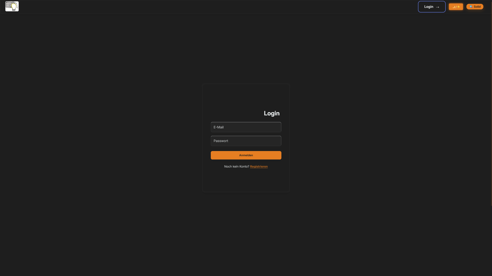

- Konto:

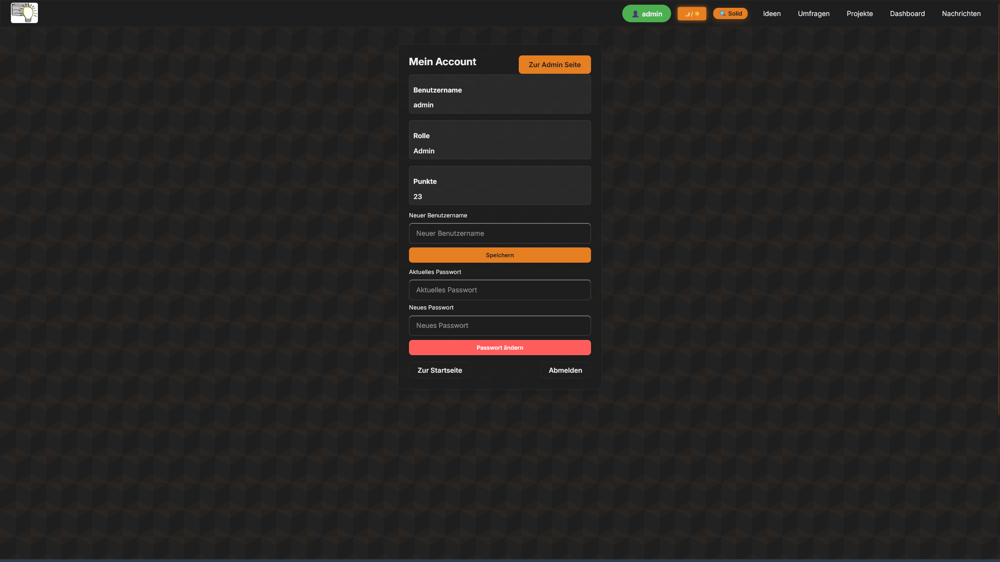

- Start seite:

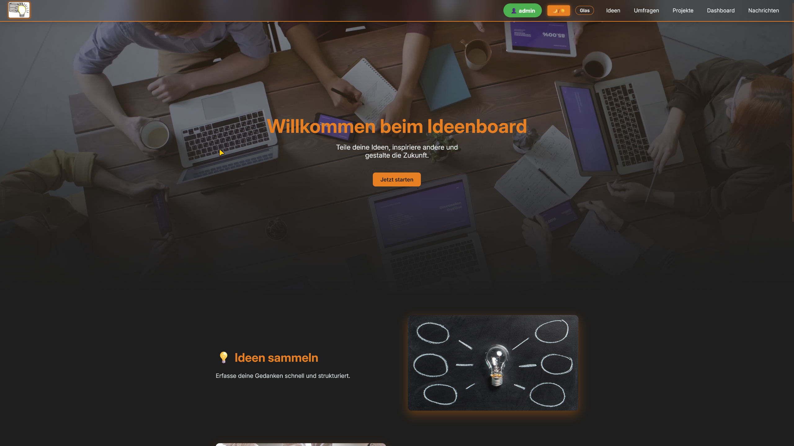

- Ideen Seite:

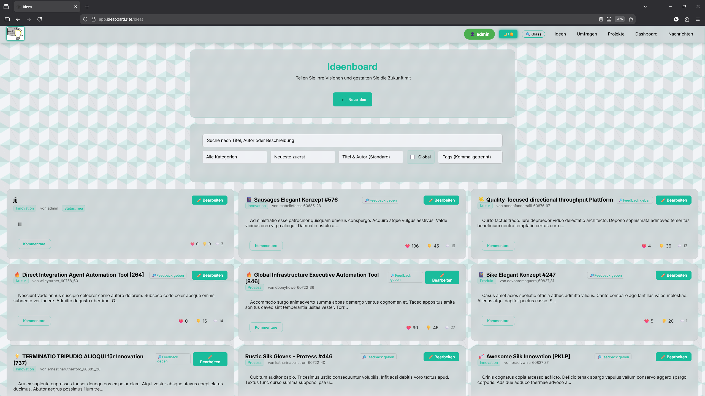

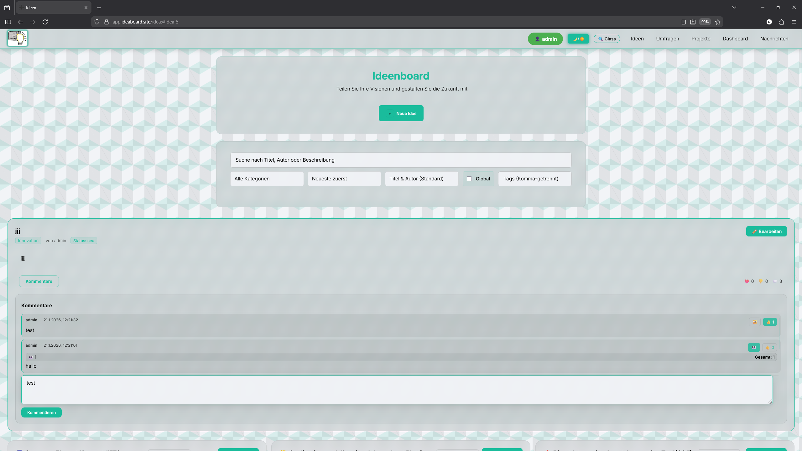

- Umfragen:

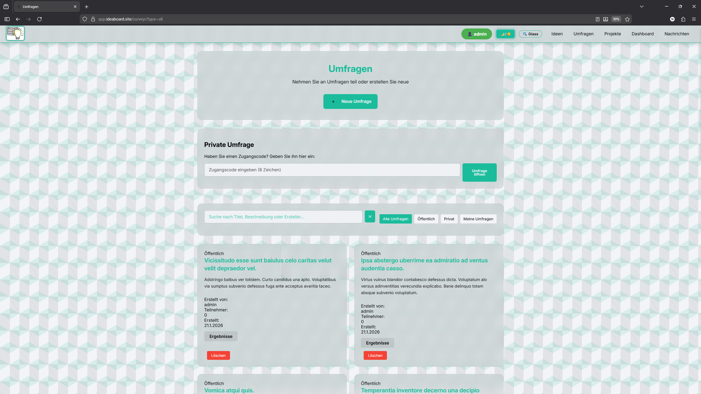

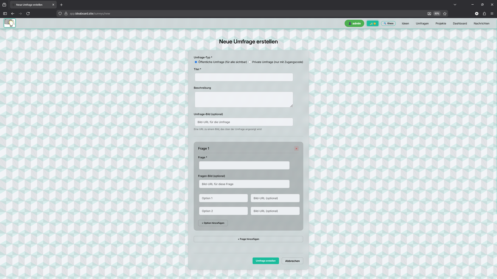

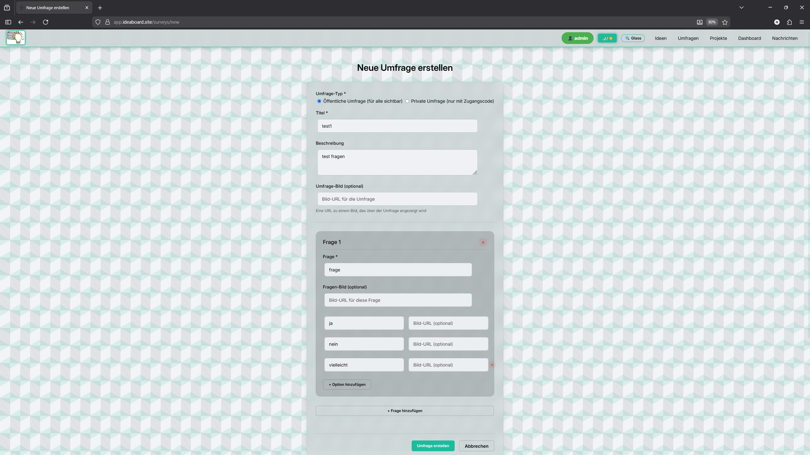

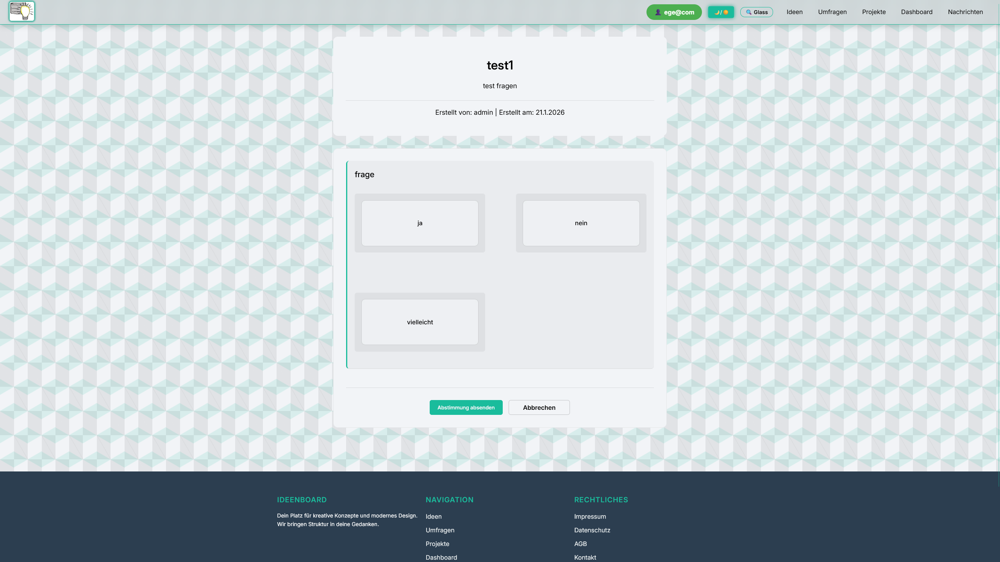


- extra Mobile bilder:


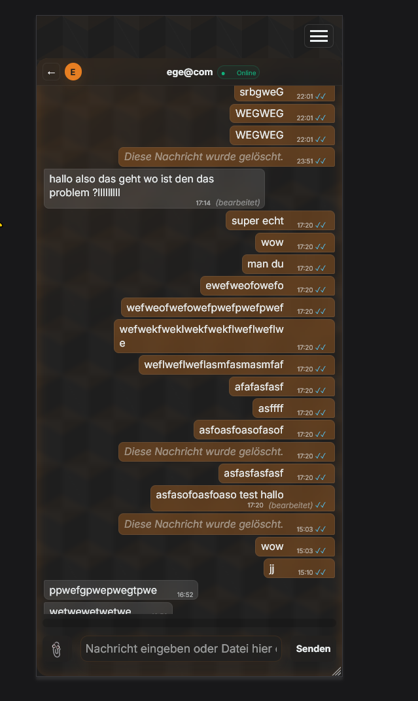

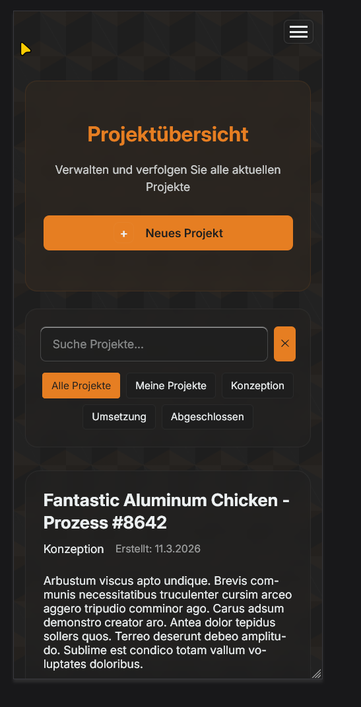

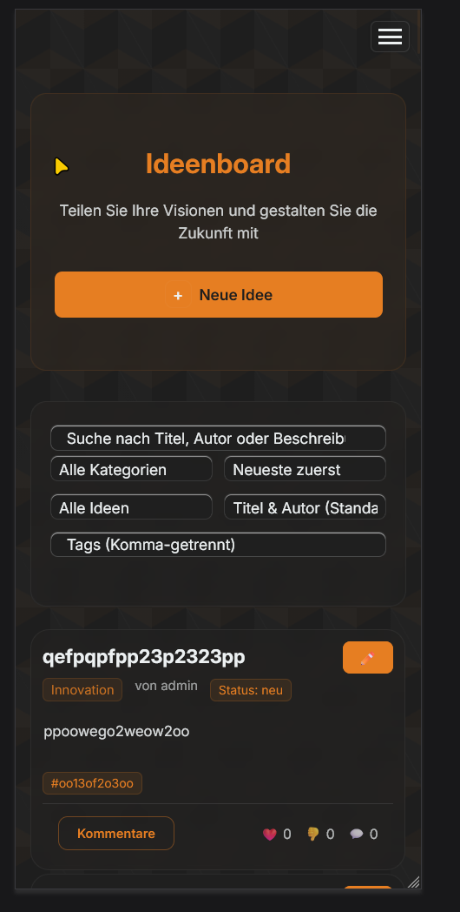

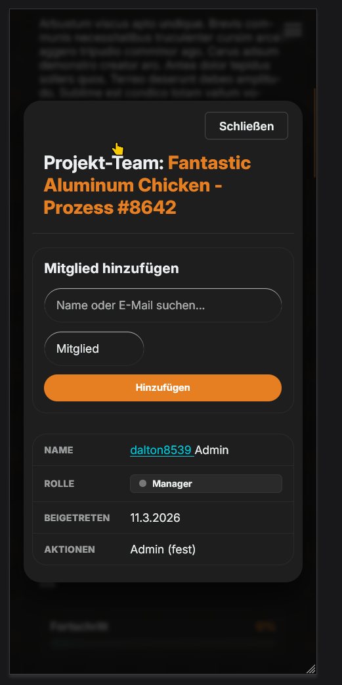
